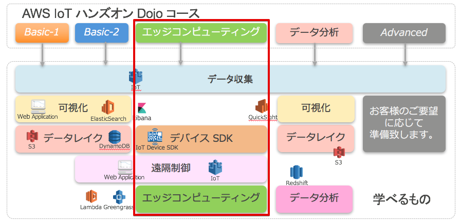
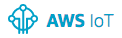

=======================
イントロダクション
=======================

AWS IoT ハンズオン Dojo コース
============================================

今回のAWS IoT ハンズオン Dojo コースは、AWS Greengrassに的を絞ったものになります。
Greengrassを使った **エッジコンピューティング** を学ぶことが出来るコースです。

|

ハンズオンシナリオ
====================

Greengrass coreをRaspberry Piに導入し、センサーデバイス、アラームデバイスと連携させます。クラウドからGreengrass coreにLambda関数をデプロイし、センサーデバイスからの計測データをエッジ内で処理させ、デバイスがオフラインになってもエッジでの処理が停止することなく動作することを確認します。

.. image:: images/01/overview.png

|

利用するデバイス、アプリケーション、サービス
========================================================

**Raspberry Pi 3**

レンジャーシステムズ社が提供するBLE/WiFiゲートウェイです。本ハンズオンでは、センサーからBLE経由で温度/湿度データ取得し、AWS IoTへのデータ送信に利用します。レンジャーシステムズ社のゲートウェイは、AWS IoTに直接接続可能で、AWSとの親和性が非常に高い製品です。他にLTE版のゲートウエイもあります。
    http://www.ranger-systems.co.jp/iot/

|

**AWSアカウント**

センサーデータの保存先として使用するAWSを利用・管理するためのアカウント。アカウント作成の手順はこちらの通りです。
    https://aws.amazon.com/jp/register-flow/

|

**AWS IoT**

接続されたデバイスが安全かつ簡単にクラウドアプリケーションやその他のデバイスとやりとりするためのマネージド型プラットフォームです。本ハンズオンでは、デバイスからのセンサーデータの受信で利用します。
    https://aws.amazon.com/jp/iot/

|

**AWS Greengrass**

接続されたデバイスでローカルのコンピューティング、メッセージング、データキャッシュ、および同期。
AWS Lambda と AWS IoT を使用して AWS クラウドとローカルデバイス全体で IoT アプリケーションをシームレスに実行する。
    https://aws.amazon.com/jp/greengrass/

.. image:: images/01/AWS_Greengrass.png

  :scale: 25

|

**AWS Lambda**

お客様のコードをイベント発生時やリクエストごとに実行できる管理不要なコンピューティングプラットフォームです。本ハンズオンでは、AWS Greengrassで使用します。
    https://aws.amazon.com/jp/lambda/

|

**Amazon CloudWatch**

AWSクラウドリソースとAWSで実行するアプリケーションのモニタリングサービスです。メトリクスの収集、ログファイルの収集が可能です。本ハンズオンではCloudWatch Logsを利用してAWS IoTのログを収集、閲覧します。
    https://aws.amazon.com/jp/cloudwatch/

|

事前準備
==============

* VNCクライアント

Raspberry Piの操作は、VNCを使用してリモートで行います。VNC接続に必要なソフトウェアをURLからダウンロードし、インストールしておいて下さい。

https://www.realvnc.com/download/viewer/

(Mac/Windows共通)

設定によっては、インストール出来ない場合があります。
その場合、インストーラーを"管理者として実行"してみて下さい。

サンプルプログラム
======================

本ハンズオンで利用するサンプルプログラムです。

* `Raspberry Pi 用 SDカードイメージ
 <https://s3-.....zip>_`

* `Lambda関数パッケージ
 <https://s3-.....zip>_`

参考情報
=======

* `AWS IoT Device SDK C++
 <https://github.com/aws/aws-iot-device-sdk-cpp>`_
