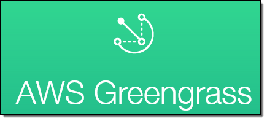

=======================
イントロダクション
=======================

AWS IoT ハンズオン Dojo コース
============================================

今回のAWS IoT ハンズオン Dojo コースは、AWS Greengrassに的を絞ったものになります。
Greengrassを使った _エッジコンピューティング_ を学ぶことが出来るコースです。

.. image:: images/01/dojo_course.png

|

ハンズオンシナリオ
====================

Greengrass coreをRaspberry Piに導入し、センサーデバイス、アラートデバイスと連携させます。クラウドからGreengrass coreにLambda関数をデプロイし、センサーデバイスからの計測データをエッジ内で処理させます。デバイスがオフライン状態であっても、エッジでの処理(ローカル Lambda)が停止することなく処理が行われることを確認します。

.. image:: images/01/overview.png

|

利用するデバイス、アプリケーション、サービス
========================================================

Raspberry Pi
--------------------

ARMプロセッサーを搭載したシングルボードコンピュータ。
Linuxで動作し、microSDメモリーカード (microSD) を起動および長期保存用のストレージに利用する。
    https://ja.wikipedia.org/wiki/Raspberry_Pi

|

AWSアカウント
--------------------

AWSを利用・管理するためのアカウント。アカウント作成の手順はこちらの通りです。
    https://aws.amazon.com/jp/register-flow/

|

AWS IoT
--------------------

接続されたデバイスが安全かつ簡単にクラウドアプリケーションやその他のデバイスとやりとりするためのマネージド型プラットフォームです。本ハンズオンでは、デバイスからのセンサーデータの受信で利用します。
    https://aws.amazon.com/jp/iot/

.. image:: images/01/AWS_IoT.png

|

AWS Greengrass
--------------------

接続されたデバイスでローカルのコンピューティング、メッセージング、データキャッシュ、および同期。
AWS Lambda と AWS IoT を使用して AWS クラウドとローカルデバイス全体で IoT アプリケーションをシームレスに実行する。
    https://aws.amazon.com/jp/greengrass/

|

**AWS IoT Device SDK**

AWS IoT デバイス SDK を使用すれば、ハードウェアデバイスを簡単かつすばやく AWS IoT に接続できます。この SDK では、AWS IoT によって準備されているデバイスゲートウェイおよびデバイスのシャドウとハードウェアデバイスとをシームレスかつセキュアに連携させられるよう、機能が強化されています。
今回のGreengrassハンズオンでは、C++言語版のDevice SDKを使用します。
    https://aws.amazon.com/jp/iot/sdk/

|

AWS Lambda
--------------------

お客様のコードをイベント発生時やリクエストごとに実行できる管理不要なコンピューティングプラットフォームです。本ハンズオンでは、AWS Greengrassで使用します。
    https://aws.amazon.com/jp/lambda/

|

Amazon CloudWatch
--------------------

AWSクラウドリソースとAWSで実行するアプリケーションのモニタリングサービスです。メトリクスの収集、ログファイルの収集が可能です。本ハンズオンではCloudWatch Logsを利用してAWS IoTのログを収集、閲覧します。
    https://aws.amazon.com/jp/cloudwatch/

|

事前準備
==============

VNCクライアント
-----------------------------

Raspberry Piの操作は、VNCを使用してリモートで行います。VNC接続に必要なソフトウェアをURLからダウンロードし、インストールしておいて下さい。

https://www.realvnc.com/download/viewer/

(Mac/Windows共通)

設定によっては、インストール出来ない場合があります。
その場合、インストーラーを"管理者として実行"してみて下さい。

|

サンプルファイル
======================

本ハンズオンで利用するファイルです。

# Raspberry Pi 用 SDカードイメージ
  https://s3-us-west-2.amazonaws.com/greengrass-trial/GG_Handson.img.zip

  本ハンズオンでは、このイメージをSDカードに書き込んだものを用意します。
  下記のツールを使ってSDカードに書き込むことも出来ます。
  https://etcher.io/

# Lambda関数パッケージ
  https://s3-us-west-2.amazonaws.com/greengrass-trial/GGhandsonLambda.zip

参考情報
======================

* AWS IoT Device SDK C++
  https://github.com/aws/aws-iot-device-sdk-cpp
