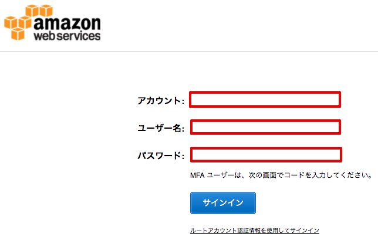
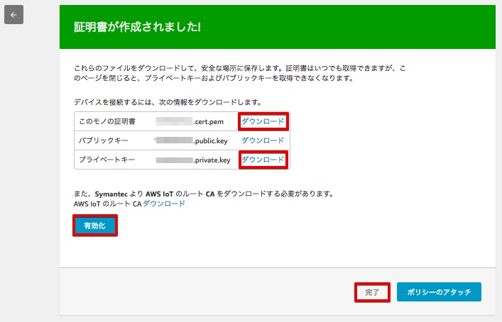

================================================================
AWS IoTの設定
================================================================

この章ではAWS IoTにセンサーデバイス、アラートデバイスを作成し、セキュリティーやポリシーの設定を行います。

|

AWS マネジメントコンソールにログイン
============================

まずは、下記のURLにアクセスして、アカウントID、ユーザー名、パスワードを入力しAWSマネージメントコンソールにサインインして下さい。

https://console.aws.amazon.com/

============= ============================
項目              値
============= ============================
アカウント	        AWSのアカウントID (12桁の数字)
ユーザー名         IAMユーザー名
パスワード         IAMユーザー パスワード
============= ============================

|

AWS IoT エンドポイント
===========================

Raspberry Pi上のGreengrassコア、センサーデバイス、アラートデバイスの設定ファイルに、AWS IoTのエンドポイントを記入する必要があります。

AWSマネージメントコンソールを開き、右上のリージョン一覧から
[米国西部(オレゴン)]を選択します。

.. image:: images/02/regions-us@2x.png

|

サービス一覧から [AWS IoT] をクリックして開きます。

|

メニューから [設定] をクリックして下さい。エンドポイントが表示されます。

.. image:: images/02/endpoint.png

|

ノートパッドなどに記録しておいて下さい。

**記録**

::

  AWS IoT endpoint
    "endpoint": "xxxxxxxxxxxx.iot.us-west-2.amazonaws.com"

|

モノ(Thing)の作成
======================

メニューから [登録] をクリックして下さい。
まだ何も登録していない場合は下記が表示されますので[モノの登録]をクリックして下さい。

※ 1つ以上モノ(Thing)を登録している場合は一覧が表示されますので画面右上の[作成]をクリックして下さい。

|

モノの登録 画面が表示されますので、[名前]に”Alert-<参加者番号>”と入力し、[モノの作成]をクリックします。

============= ============================
項目            値
============= ============================
Name	          Alert-<参加者番号>
============= ============================

.. image:: images/02/create-thing-Alert.png

|

アラートデバイス：Alert-<参加者番号> が作成されました。

.. image:: images/02/create-thing-Alert-2.png

|

[←]をクリックして下さい。センサーデバイスも作成します。

[作成]をクリックします。

|

[名前]に”Sensor-<参加者番号>”と入力し、[モノの作成]を再度、クリックします。

============= ============================
項目            値
============= ============================
Name	          Sensor-<参加者番号>
============= ============================

.. image:: images/02/create-thing-Sensor-2.png

|

センサーデバイス：Sensor-<参加者番号> が作成されました。

|

[←]をクリックして下さい。

アラートデバイスとセンサーデバイスが作成されました。

|

証明書の作成(アラートデバイス)
=======================

アラートデバイス用の証明書を作成します。

メニューから[セキュリティー]をクリックします。
まだ何も登録していない場合は下記が表示されますので[証明書を作成する]をクリックして下さい。

|

※ 1つ以上証明書を登録している場合は一覧が表示されますので画面右上の[作成]をクリックして下さい。

.. image:: images/02/create-certificate.png

|

[1-Click 証明書作成 (推薦)]の右の[証明書の作成]をクリックします。

|

下記の様に、"証明書が作成されました!" と表示されたら、[このモノの証明書] と [プライベートキー] をダウンロードして下さい。

この画面で、アラートデバイスの証明書とプライベートキーをPCにダウンロードして下さい。
[有効化] をクリックして、証明書をアクティブにし、最後に、[完了] をクリックして下さい。

|

ダウンロードした証明書とプライベートキーは、後にRaspberry Piにコピーし、アラートデバイスで使用します。
(~/GGHandson/alert_device 下にコピーします。) また、証明書の番号は、アラートデバイス用と分かる様にノートパッドなどに記録しておいて下さい。

**記録**

::

  Alarm Device: Alert-<参加者番号>
    "device_certificate_relative_path": "yyyyyyyyyy-certificate.pem.crt",
    "device_private_key_relative_path": "yyyyyyyyyy-private.pem.key",

|

ポリシーの作成(アラートデバイス)
==========================

アラートデバイス(用の証明書)に付与するポリシーを追加します。

メニューから[セキュリティー]＞[ポリシー]をクリックします。
まだ何も登録していない場合は下記が表示されますので[ポリシーの作成]をクリックして下さい。

.. image:: images/02/iot-policy-first.png

|

※ 1つ以上ポリシーを登録している場合は一覧が表示されますので画面右上の[作成]をクリックして下さい。

|

アラートデバイス用の証明書に付与するポリシーを作成します。
下記のとおり入力し、[作成]をクリックして下さい。
アクションを選択するとリソースARNとして
[arn:aws:iot:us-west-2:<アカウント番号>:topic/replaceWithATopic]
が自動で記入されますが、[*]に置き換えて下さい。

============= ============================
項目            値
============= ============================
名前	          Alert-<参加者番号>-policy
アクション         iot:*
リソース ARN          \*
============= ============================

|

アラートデバイスに付与するポリシーが作成されました。

|

※ 今回のハンズオンでは簡易化のため、アラートデバイスがAWS IoTにおける全アクションを全リソースに対して行えるポリシーを付与しますが、実際に使用する場合は、デバイスが必要とするアクションとリソースに制限することを検討して下さい。

証明書にポリシーをアタッチする(アラートデバイス)
==========================

証明書の画面に戻ります。アラートデバイス用の証明書をクリックしてください。

.. image:: images/02/attach-thing-Alert.png

|

証明書の詳細が表示されます。右上の [アクション] メニューから [ポリシーのアタッチ] を選んで下さい。

|

[Alert-<参加者番号>-policy] が、表示されますので、チェックを入れて、[アタッチ] をクリックして下さい。

|

アラートデバイスに付与するポリシーが証明書に付与されました。
証明書の詳細にて、[ポリシー]を選択すると[Alert-<参加者番号>-policy] が、表示されることを確認して下さい。

|

証明書にモノをアタッチする(アラートデバイス)
====================================

ポリシーが紐付けられたを証明書にモノをアタッチすることで、モノの認証と権限の設定が完了します。

続けて証明書の詳細にて、右上の [アクション] メニューから [モノをアタッチする] を撰んで下さい。

|

[Alert-<参加者番号>] が、表示されますので、チェックを入れて、[アタッチ] をクリックして下さい。

|

証明書がアラートデバイスに付与されました。
証明書の詳細にて、[モノ]を選択すると[Alert-<参加者番号>] が、表示されることを確認して下さい。

|
**センサーデバイスについても、同様の操作を行い、証明書の作成、ポリシーの作成、証明書にポリシーをアタッチ、証明書にモノをアタッチして下さい。**

証明書の作成(センサーデバイス)
=======================

センサーデバイス用の証明書を作成します。

メニューから[セキュリティー]をクリックします。
一覧が表示されますので右上の[作成]をクリックして下さい。

.. image:: images/02/create-certificate.png

|

[1-Click 証明書作成 (推薦)]の右の[証明書の作成]をクリックします。

|

下記の様に、"証明書が作成されました!" と表示されたら、[このモノの証明書] と [プライベートキー] をダウンロードして下さい。

この画面で、センサーデバイスの証明書とプライベートキーをPCにダウンロードして下さい。
[有効化] をクリックして、証明書をアクティブにし、最後に、[完了] をクリックして下さい。

|

ダウンロードした証明書とプライベートキーは、後にRaspberry Piにコピーし、センサーデバイスで使用します。
(~/GGHandson/sensor_device 下にコピーします。) また、証明書の番号は、センサーデバイス用と分かる様にノートパッドなどに記録しておいて下さい。

**記録**

::

  Sensor Device: Sensor-<参加者番号>
    "device_certificate_relative_path": "zzzzzzzzzz-certificate.pem.crt",
    "device_private_key_relative_path": "zzzzzzzzzz-private.pem.key",

|

ポリシーの作成(センサーデバイス)
==========================

センサーデバイス(用の証明書)に付与するポリシーを追加します。

メニューから[セキュリティー]＞[ポリシー]をクリックします。
一覧が表示されますので画面右上の[作成]をクリックして下さい。

|

センサーデバイス用の証明書に付与するポリシーを作成します。
下記のとおり入力し、[作成]をクリックして下さい。
アクションを選択するとリソースARNとして
[arn:aws:iot:us-west-2:<アカウント番号>:topic/replaceWithATopic]
が自動で記入されますので、[topic]以下の[replaceWithATopic]を[*]に置き換えて下さい。

============= ============================
項目            値
============= ============================
名前	          Sensor-<参加者番号>-policy
アクション         iot:*
リソース ARN          \*
============= ============================

|

センサーデバイスに付与するポリシーが作成されました。

|

※ 今回のハンズオンでは簡易化のため、センサーデバイスがAWS IoTにおける全アクションを全リソースに対して行えるポリシーを付与しますが、実際に使用する場合は、デバイスが必要とするアクションとリソースに制限することを検討して下さい。

証明書にポリシーをアタッチする(センサーデバイス)
==========================

証明書の画面に戻ります。センサーデバイス用の証明書をクリックしてください。

.. image:: images/02/attach-thing-Alert.png

|

証明書の詳細が表示されます。右上の [アクション] メニューから [ポリシーのアタッチ] を選んで下さい。

|

[Sensor-<参加者番号>-policy] が、表示されますので、チェックを入れて、[アタッチ] をクリックして下さい。

|

センサーデバイスに付与するポリシーが証明書に付与されました。
証明書の詳細にて、[ポリシー]を選択すると[Sensor-<参加者番号>-policy] が、表示されることを確認して下さい。

|

証明書にモノをアタッチする(センサーデバイス)
====================================

ポリシーが紐付けられたを証明書にモノをアタッチすることで、モノの認証と権限の設定が完了します。

続けて証明書の詳細にて、右上の [アクション] メニューから [モノをアタッチする] を撰んで下さい。

|

[Sensor-<参加者番号>] が、表示されますので、チェックを入れて、[アタッチ] をクリックして下さい。

|

証明書がセンサーデバイスに付与されました。
証明書の詳細にて、[モノ]を選択すると[Sensor-<参加者番号>] が、表示されることを確認して下さい。

|

これで、AWS IoTの基本設定は、終わりです。
