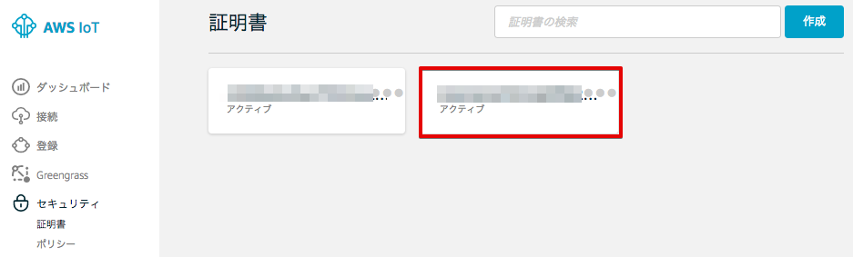

================================================================
AWS IoTの設定
================================================================

AWS IoTにセンサーデバイス、アラートデバイスを作成し、セキュリティーやポリシーの設定を行います。

モノ(Thing)の作成
======================

[←]をクリックして下さい。メニューから [登録] をクリックして下さい。

モノ(Thing)の一覧が表示されます。

|

既に、作成済みの Greengrassコアデバイス [GGC_Thing-<参加者番号>] が、モノとして表示されます。[作成]をクリックします。

.. image:: images/03/create-thing-2.png

|

モノの登録 画面が表示されますので、[名前]に”Alert-<参加者番号>”と入力し、[モノの作成]をクリックします。

============= ============================
項目            値
============= ============================
Name	          Alert-<参加者番号>
============= ============================

.. image:: images/03/create-thing-Alert.png

|

アラートデバイス：Alert-<参加者番号> が作成されました。

.. image:: images/03/create-thing-Alert-2.png

|

[←]をクリックして下さい。センサーデバイスも作成します。

作成済みの アラートデバイス：Alert-<参加者番号> が、モノとして追加されています。[作成]をクリックします。

.. image:: images/03/create-thing-Sensor.png

|

[名前]に”Sensor-<参加者番号>”と入力し、[モノの作成]を再度、クリックします。

============= ============================
項目            値
============= ============================
Name	          Sensor-<参加者番号>
============= ============================

.. image:: images/03/create-thing-Sensor-2.png

|

アラートデバイス：Sensor-<参加者番号> が作成されました。

.. image:: images/03/create-thing-Sensor-3.png

|

[←]をクリックして下さい。

証明書の作成
=======================

センサーデバイス、アラートデバイス用の証明書を作成します。

メニューから[セキュリティー]をクリックします。

|

証明書の画面が表示されます。[作成] をクリックします。

|

[1-Click 証明書作成 (推薦)]の右の[証明書の作成]をクリックします。

.. image:: images/03/create-certificate-one-click.png

|

下記の様に、"証明書が作成されました!" と表示されたら、[このモノの証明書] と [プライベートキー] をダウンロードして下さい。

各ファイルのサイズは、Greengrassコアデバイス用の証明書、プライベートキーと同じです。

この画面で、Greengrassコアデバイス用の証明書とプライベートキーをPCにダウンロードして下さい。
[有効化] をクリックして、証明書をアクティブにして下さい。最後に、[ポリシーのアタッチ] をクリックして、ポリシーをアタッチします。

|

ダウンロードした証明書とプライベートキーは、後にRaspberry Piにコピーし、アラートデバイスで使用します。
(/aws-iot-device-sdk-cpp/certs/handsonAlarm 下にコピーします。) また、証明書の番号は、アラートデバイス用と分かる様にノートパッドなどに記録しておいて下さい。

**記録**

::

  Alarm Device: Alert-00
  "device_certificate_relative_path": "certs/handsonAlarm/xxxxxxxxxx-certificate.pem.crt",
  "device_private_key_relative_path": "certs/handsonAlarm/cccccccccc-private.pem.key",

|

アラートデバイス用の証明書とプライベートキーは、Raspberry Pi上の アラートデバイス用の設定ファイル
::

  /aws-iot-device-sdk-cpp/common/HandsonAlarmConfig.json

|

に記載します。HandsonAlarmConfig.json は、下記の様な内容になっています。
記録した 証明書とプライベートキーの情報は、"device_certificate_relative_path" と "device_private_key_relative_path" になります。

::

  HandsonAlarmConfig.json
  {
    "endpoint": "xxxxxxxxxxxx.iot.us-west-2.amazonaws.com",
    "mqtt_port": 8883,
    "https_port": 443,
    "greengrass_discovery_port": 8443,
    "root_ca_relative_path": "certs/handsonAlarm/root-ca.pem",
    "device_certificate_relative_path": "certs/handsonAlarm/xxxxxxxxxx-certificate.pem.crt",
    "device_private_key_relative_path": "certs/handsonAlarm/xxxxxxxxxx-private.pem.key",
    "tls_handshake_timeout_msecs": 60000,
    "tls_read_timeout_msecs": 2000,
    "tls_write_timeout_msecs": 2000,
    "aws_region": "us-west-2",
    "aws_access_key_id": "",
    "aws_secret_access_key": "",
    "aws_session_token": "",
    "client_id":  "Alert-00",
    "thing_name": "Alert-00",
    "is_clean_session": true,
    "mqtt_command_timeout_msecs": 20000,
    "keepalive_interval_secs": 30,
    "minimum_reconnect_interval_secs": 1,
    "maximum_reconnect_interval_secs": 128,
    "maximum_acks_to_wait_for": 32,
    "action_processing_rate_hz": 5,
    "maximum_outgoing_action_queue_length": 32,
    "discover_action_timeout_msecs": 300000
  }

|

証明書に権限を追加する
==========================

Greengrassグループの作成で自動的に生成されたポリシー [GGC_Thing-<参加者番号>-policy] が、表示されますので、チェックを入れて、[完了] をクリックして下さい。

.. image:: images/03/attach-policy-Alert.png

|

※ 今回のハンズオンでは、Greengrassコア用のポリシーをモノでも使用しますが、実際に使用する場合は、デバイスの動作に合った権限だけに制限することをお勧めします。

証明書にモノをアタッチする
====================================

モノに権限が紐付けられたを証明書をアタッチすることで、モノの認証と権限を設定します。

証明書の画面に戻ります。アラートデバイス用の証明書をクリックしてください。

|

証明書の

これらは、後ほど、BLEゲートウェイにアップロードします。証明書の番号は、後ほど証明書の割当てのところで参照しますので、ノートパッドなどに記録しておいて下さい。
証明書の番号とは、ファイル名が "xxxxxxxxxx-certificate.pem.crt" の場合、冒頭の "xxxxxxxxxx" になります。

証明書とプライベートキーのダウンロードが終わったら、[Activate] をクリックして証明書を有効にして下さい。

.. image:: images/02/certificate-created.png

|

最後に、左上の[←]を２回押して、戻って下さい。先ほど作成した証明書が表示され、"**ACTIVATE**" 状態になっている確認して下さい。

.. image:: images/02/confirm-certificate.png

|

.. image:: images/02/create-thing-4.png

|

モノに証明書をアタッチする
=================================

メニューから[Settings]をクリックします。以下の様な画面が表示されます。
EndpointのURLが表示されます。このEndpointは、ゲートウェイがデータを送信する宛先になります。後ほどゲートウェイの設定のところで参照しますので、ノートパッドなどに記録しておいて下さい。

.. image:: images/02/endpoint.png

|

ポリシーの作成
===========================

デバイスに対して、AWS IoTの各種操作を許可するためのポリシーを作成します。メニューから[Security]-[Policies]をクリックします。以下の様な画面が表示された場合は、[Create a policy] をクリックします。

.. image:: images/02/create-policy.png

|

あるいは、ポリシー一覧が表示された場合は、[Create]をクリックします。

.. image:: images/02/create-policy-2.png

|

フォームにそれぞれ以下のパラメータを入力し、[Create] をクリックします。

============= ============================
項目            値
============= ============================
Name	          awsiot-handson-policy-<参加者番号>
Action	        iot:*
Resource ARN	  *
Effect	        Allow (チェックを入れて下さい)
============= ============================

"*"は、半角の＊(アスタリスク)です。

.. image:: images/02/create-policy-3.png

|

[←]をクリックして下さい。

ポリシーの一覧が表示され、作成したポリシーが表示されている事を確認します。

.. image:: images/02/create-policy-4.png

|

デバイス、ポリシーを証明書に割当てる
===========================================

作成したデバイス、ポリシーを証明書に割当てます。メニューから[Security]-[Certificates]をクリックします。証明書一覧から「証明書の作成」のセクションで保存した証明書のIDに一致する証明書をクリックして開きます。

.. image:: images/02/attach-policy-thing.png

|

証明書の詳細が表示されます。[Actions] - [Attach policy]を選択します。

.. image:: images/02/attach-policy.png

|

”awsiot-handson-policy-<参加者番号>”を選択し、[Attach] をクリックします。

.. image:: images/02/attach-policy-2.png

|

[Actions] - [Attach thing]を選択します。

.. image:: images/02/attach-thing.png

|

“ranger-gw-<参加者番号>”を入力し、[Attach] をクリックします。

.. image:: images/02/attach-thing-2.png

|

これで、AWS IoTの基本設定は、終わりです。
