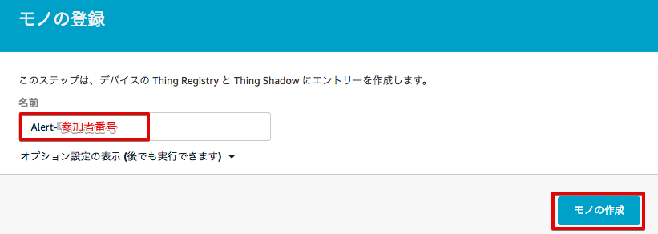
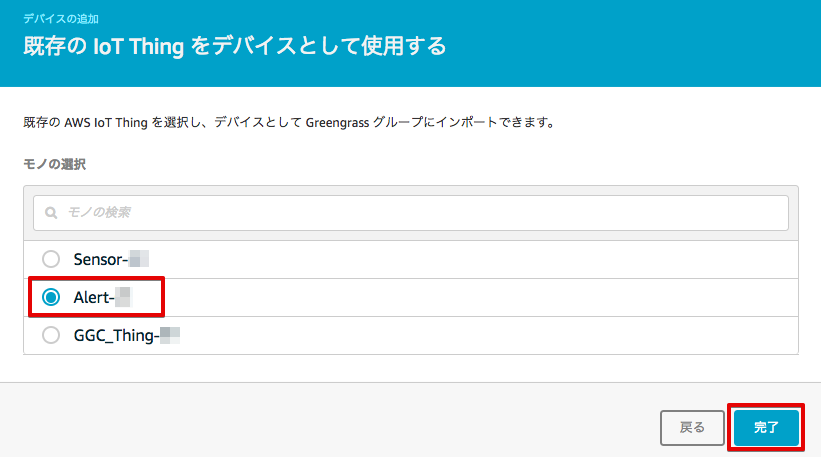

================================================================
AWS IoTの設定
================================================================

AWS IoTにセンサーデバイス、アラートデバイスを作成し、セキュリティーやポリシーの設定を行います。

AWS IoT エンドポイント
===========================

Raspberry Pi上のGreengrassコア、センサーデバイス、アラートデバイスの設定ファイルに、AWS IoTのエンドポイントを記入する必要があります。

[←]をクリックして下さい。メニューから [設定] をクリックして下さい。エンドポイントが表示されます。

|

ノートパッドなどに記録しておいて下さい。

**記録**

::

  AWS IoT endpoint
    "endpoint": "xxxxxxxxxxxx.iot.us-west-2.amazonaws.com"

|

モノ(Thing)の作成
======================

メニューから [登録] をクリックして下さい。

モノ(Thing)の一覧が表示されます。

.. image:: images/03/create-thing.png

|

既に、作成済みの Greengrassコアデバイス [GGC_Thing-<参加者番号>] が、モノとして表示されます。[作成]をクリックします。

|

モノの登録 画面が表示されますので、[名前]に”Alert-<参加者番号>”と入力し、[モノの作成]をクリックします。

============= ============================
項目            値
============= ============================
Name	          Alert-<参加者番号>
============= ============================

|

アラートデバイス：Alert-<参加者番号> が作成されました。

.. image:: images/03/create-thing-Alert-2.png

|

[←]をクリックして下さい。センサーデバイスも作成します。

作成済みの アラートデバイス：Alert-<参加者番号> が、モノとして追加されています。[作成]をクリックします。

|

[名前]に”Sensor-<参加者番号>”と入力し、[モノの作成]を再度、クリックします。

============= ============================
項目            値
============= ============================
Name	          Sensor-<参加者番号>
============= ============================

|

アラートデバイス：Sensor-<参加者番号> が作成されました。

.. image:: images/03/create-thing-Sensor-3.png

|

[←]をクリックして下さい。

証明書の作成
=======================

アラートデバイス用の証明書を作成します。

メニューから[セキュリティー]をクリックします。

.. image:: images/03/goto-security.png

|

証明書の画面が表示されます。[作成] をクリックします。

.. image:: images/03/create-certificate.png

|

[1-Click 証明書作成 (推薦)]の右の[証明書の作成]をクリックします。

.. image:: images/03/create-certificate-one-click.png

|

下記の様に、"証明書が作成されました!" と表示されたら、[このモノの証明書] と [プライベートキー] をダウンロードして下さい。

各ファイルのサイズは、Greengrassコアデバイス用の証明書、プライベートキーと同じです。

この画面で、Greengrassコアデバイス用の証明書とプライベートキーをPCにダウンロードして下さい。
[有効化] をクリックして、証明書をアクティブにして下さい。最後に、[ポリシーのアタッチ] をクリックして、ポリシーをアタッチします。

.. image:: images/03/download-certificate-activate.png

|

ダウンロードした証明書とプライベートキーは、後にRaspberry Piにコピーし、アラートデバイスで使用します。
(/aws-iot-device-sdk-cpp/certs/handsonAlarm 下にコピーします。) また、証明書の番号は、アラートデバイス用と分かる様にノートパッドなどに記録しておいて下さい。

**記録**

::

  Alarm Device: Alert-01
    "device_certificate_relative_path": "certs/handsonAlarm/yyyyyyyyyy-certificate.pem.crt",
    "device_private_key_relative_path": "certs/handsonAlarm/yyyyyyyyyy-private.pem.key",

|

アラートデバイス用の証明書とプライベートキーは、Raspberry Pi上の アラートデバイス用の設定ファイル
::

  /aws-iot-device-sdk-cpp/common/HandsonAlarmConfig.json

|

に記載します。HandsonAlarmConfig.json は、下記の様な内容になっています。
記録した 証明書とプライベートキーの情報は、"device_certificate_relative_path" と "device_private_key_relative_path" になります。

::

  HandsonAlarmConfig.json
  {
    "endpoint": "xxxxxxxxxxxx.iot.us-west-2.amazonaws.com",
    "mqtt_port": 8883,
    "https_port": 443,
    "greengrass_discovery_port": 8443,
    "root_ca_relative_path": "certs/handsonAlarm/root-ca.pem",
    "device_certificate_relative_path": "certs/handsonAlarm/yyyyyyyyyy-certificate.pem.crt",
    "device_private_key_relative_path": "certs/handsonAlarm/yyyyyyyyyy-private.pem.key",
    "tls_handshake_timeout_msecs": 60000,
    "tls_read_timeout_msecs": 2000,
    "tls_write_timeout_msecs": 2000,
    "aws_region": "us-west-2",
    "aws_access_key_id": "",
    "aws_secret_access_key": "",
    "aws_session_token": "",
    "client_id":  "Alert-01",
    "thing_name": "Alert-01",
    "is_clean_session": true,
    "mqtt_command_timeout_msecs": 20000,
    "keepalive_interval_secs": 30,
    "minimum_reconnect_interval_secs": 1,
    "maximum_reconnect_interval_secs": 128,
    "maximum_acks_to_wait_for": 32,
    "action_processing_rate_hz": 5,
    "maximum_outgoing_action_queue_length": 32,
    "discover_action_timeout_msecs": 300000
  }

|

証明書に権限を追加する
==========================

Greengrassグループの作成で自動的に生成されたポリシー [GGC_Thing-<参加者番号>-policy] が、表示されますので、チェックを入れて、[完了] をクリックして下さい。

|

※ 今回のハンズオンでは、Greengrassコア用のポリシーをモノでも使用しますが、実際に使用する場合は、デバイスの動作に合ったアクセス権限だけに制限することをお勧めします。

証明書にモノをアタッチする
====================================

権限が紐付けられたを証明書にモノをアタッチすることで、モノの認証と権限の設定が完了します。

証明書の画面に戻ります。アラートデバイス用の証明書をクリックしてください。

.. image:: images/03/attach-thing-Alert.png

|

証明書の詳細が表示されます。右上の [アクション] メニューから [モノをアタッチする] を撰んで下さい。

.. image:: images/03/attach-thing-Alert-2.png

|

[Alert-<参加者番号＞] が、表示されますので、チェックを入れて、[アタッチ] をクリックして下さい。

.. image:: images/03/attach-thing-Alert-3.png

|

**センサーデバイスについても、同様の操作を行い、証明書の作成、権限を追加、モノをアタッチして下さい。**

証明書の作成
=======================

センサーデバイス用の証明書を作成します。

メニューから[セキュリティー]をクリックします。

|

証明書の画面が表示されます。[作成] をクリックします。

|

[1-Click 証明書作成 (推薦)]の右の[証明書の作成]をクリックします。

.. image:: images/03/create-certificate-one-click.png

|

"証明書が作成されました!" と表示されたら、[このモノの証明書] と [プライベートキー] をダウンロードして下さい。
Greengrassコアデバイス用の証明書とプライベートキーをPCにダウンロードして下さい。
[有効化] をクリックして、証明書をアクティブにして下さい。最後に、[ポリシーのアタッチ] をクリックして、ポリシーをアタッチします。

.. image:: images/03/download-certificate-activate.png

|

ダウンロードした証明書とプライベートキーは、後にRaspberry Piにコピーし、アラートデバイスで使用します。
(/aws-iot-device-sdk-cpp/certs/handsonAlarm 下にコピーします。) また、証明書の番号は、アラートデバイス用と分かる様にノートパッドなどに記録しておいて下さい。

**記録**

::

  Sensor Device: Sensor-01
    "device_certificate_relative_path": "certs/handsonSensor/zzzzzzzzzz-certificate.pem.crt",
    "device_private_key_relative_path": "certs/handsonSensor/zzzzzzzzzz-private.pem.key",

|

アラートデバイス用の証明書とプライベートキーは、Raspberry Pi上の アラートデバイス用の設定ファイル
::

  /aws-iot-device-sdk-cpp/common/HandsonSensorConfig.json

|

証明書に権限を追加する
==========================

Greengrassグループの作成で自動的に生成されたポリシー [GGC_Thing-<参加者番号>-policy] が、表示されますので、チェックを入れて、[完了] をクリックして下さい。

|

証明書にモノをアタッチする
====================================

証明書の画面に戻ります。アラートデバイス用の証明書をクリックしてください。

.. image:: images/03/attach-thing-Sensor.png

|

証明書の詳細が表示されます。右上の [アクション] メニューから [モノをアタッチする] を撰んで下さい。

.. image:: images/03/attach-thing-Alert-2.png

|

[Alert-<参加者番号＞] が、表示されますので、チェックを入れて、[アタッチ] をクリックして下さい。

|

これで、AWS IoTの基本設定は、終わりです。

デバイスをGreengrassグループに追加する
=========================================

作成した、センサーデバイス、アラートデバイスをGreengrassグループに追加します。

Greengrassの設定画面に戻り、Greengrassグループ：GGHandsonGroup-<参加者番号> をクリックして下さい。

.. image:: images/04/greengrass-group.png

|

メニューから [デバイス] をクリックします。以下の様な画面が表示されますので、[デバイスの追加] をクリックします。

|

[IoT Thingを選択する] をクリックします。

.. image:: images/03/add-thing-to-group-2.png

|

アラートデバイス：Alert-<参加者番号> にチェックを入れ、[完了] をクリックします。

|

アラートデバイスが追加されました。[デバイスの追加] をクリックして、センサーデバイスも追加します。

.. image:: images/03/add-thing-to-group-4.png

|

センサーデバイス、アラートデバイスをGreengrassグループに追加されました。

.. image:: images/03/sync-thing-shadow.png

|

センサーデバイスのデバイス シャドウは、クラウド上のシャドウと同期させる必要があるので、設定を変更します。

[●●●] をクリックして、[クラウドに同期] をクリックして下さい。

.. image:: images/03/sync-thing-shadow-2.png

|

[クラウドへのシャドウ同期] に変更されました。

|
