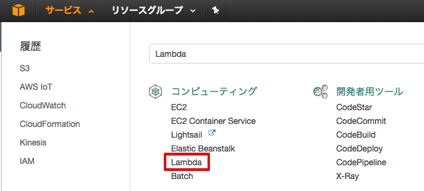
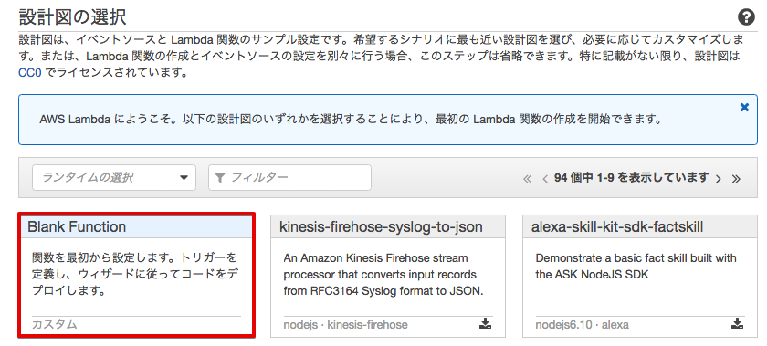
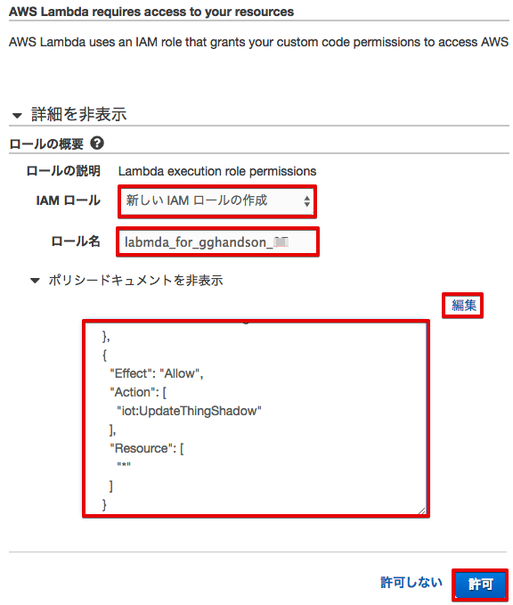
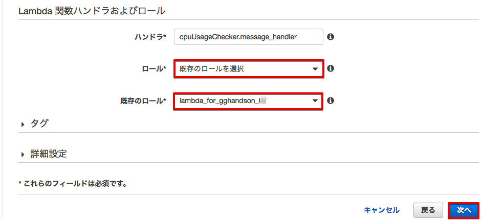
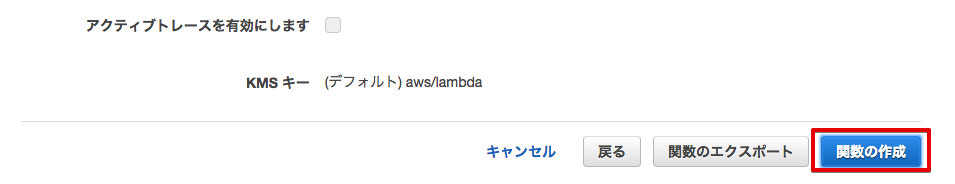

==================================================================
Lambda関数の登録とAWS IoT Lambdaルールの作成
==================================================================

この章ではAWS IoTのTopicに入力されたデータに対するルールの設定と、そのルールをトリガーに実行されるLambda関数の設定を行います。

|

Lambda関数の登録
=======================

センサーデバイスからAWS IoTに送信されたデータによってトリガーされるLambda関数を登録します。

はじめに、Lambda関数パッケージを下記のリンクからPCにダウンロードして下さい。このzipファイルは、後ほどLambdaの設定画面でアップロードします。

https://s3-us-west-2.amazonaws.com/greengrass-trial/GGhandsonLambda.zip

このパッケージは、Lambda関数(cpuUsageChecker.py)の他に、後ほどエッジで動かす際に必要なAWS Greengrass コア Python SDKを含みますが、クラウドで実行する際は利用しません。

サービス一覧から[Lambda] をクリックして開きます。

|

下記のような画面が表示されるので、[今すぐ始める] をクリックします。

.. image:: images/03/lambda-2.png

|

Lambda関数の作成画面が表示されるので、"Blank Function" をクリックします。

|

トリガーの設定画面が表示されるので、[次へ]をクリックします。

.. image:: images/03/lambda-4.png

|

ダウンロード済みのLambda関数パッケージ(GGhandsonLambda.zip)をアップロードします。
下記のような画面が表示されるので、必要事項を入力して下さい。

======================== =======================================
項目                        設定
======================== =======================================
名前                          cpuUsageChecker-<参加者番号>
説明                          a Lambda func. for gghandson
ランタイム                     Python 2.7
コード エントリ タイプ           .ZIPファイルをアップロード
関数パッケージ                  GGhandsonLambda.zip
ハンドラ                       cpuUsageChecker.message_handler
ロール                         カスタムロールの作成
======================== =======================================

|

ロール：[カスタムロールの作成] を選択すると、別画面でIAMの設定画面が出てきますので、
下記必要事項を入力して下さい。
ポリシードキュメントを編集する際、ダイアログが表示されます。
[OK] をクリック後、ポリシードキュメントが編集可能になるので、下記ポリシードキュメントをコピー＆ペーストします。

こちらのポリシードキュメントは、デフォルトで付与されているCloudWatchLogへの各種アクションに関する権限に加えて、
AWS IoTにおけるシャドウを更新する権限を追加しています。

最後に[許可]をクリックするとIAMの設定画面は閉じます。

======================== =======================================
項目                        設定
======================== =======================================
IAMロール                          新しいIAMロールの作成
ロール名                          lambda\_for\_gghandson\_<参加者番号>
ポリシードキュメント                下記に記載
======================== =======================================

**ポリシードキュメント**

::

  {
    "Version": "2012-10-17",
    "Statement": [
      {
        "Effect": "Allow",
        "Action": [
          "logs:CreateLogGroup",
          "logs:CreateLogStream",
          "logs:PutLogEvents"
        ],
        "Resource": "arn:aws:logs:*:*:*"
      },
      {
        "Effect": "Allow",
        "Action": [
          "iot:UpdateThingShadow"
        ],
        "Resource": [
          "*"
        ]
      }
    ]
  }

|

|

Lambdaの画面に戻ります。ロールが [既存ロールを選択]に変更され、ロール名として、"lambda\_for\_gghandson\_<参加者番号>" になっていることを確認し、[次へ] をクリックして下さい。

|

確認画面が表示されますので、下までスクロースし、[関数の作成] をクリックして下さい。

|

Lambda関数の作成に成功すると、下記の様な画面が表示されます。

Uploadしたzipファイルに含めたLambda関数で実行したいコードが表示されます。
本コードは入力されたデータからCPUの値を取り出し、閾値に応じてアラートデバイスのシャドウを変更する簡単なプログラムとなっています。

コード内の "thingName" が、"Alert-01" となっていますので、01 の所をご自分の参加者番号に置き換えて下さい。CPUロードが 50% を越えると、アラートを"on"にするようになっています。

修正したら、 [保存] をクリックします。

.. image:: images/03/lambda-save.png

|

これで、Lambda関数の登録は、終了です。

AWS IoT Lambdaルールの作成
=======================

Lambda関数を作成したので、Lambda関数を呼び出すAWS IoTのルールを作成します。
AWS IoTコンソールより、[ルール]をクリックして下さい。
まだ何も登録していない場合は下記が表示されますので[ルールを作成する]をクリックして下さい。

|

※ 1つ以上ルールを登録している場合は一覧が表示されますので画面右上の[作成]をクリックして下さい。

|

ルールを作成する 画面が表示されますので、[名前]に”cpuUsageRule\_<参加者番号>”(ハイフンが利用できないため、アンダースコアを使います)を入力し、説明に下記を入力して下さい。

============= ============================
項目            値
============= ============================
名前	          cpuUsageRule\_<参加者番号>
説明	          a rule for gghandson
============= ============================

|

続いてルールの以下にメッセージのリソースの設定を入力します。
[条件]には何も指定しません。

============= ============================
項目            値
============= ============================
属性	          cpuUsageRule\_<参加者番号>
トピックフィルター	    sensing/data/Sensor-<参加者番号>
条件	          　
============= ============================

|

[一つ以上のアクションを設定する]から[アクションの追加]をクリックします。

|

[アクションを選択してください]から[メッセージデータを渡す Lambda 関数を呼び出す]を選択し、[アクションの設定]をクリックします。

|

|

[リソースの選択]ドロップダウンリストで先ほど作成したLambda関数名[cpuUsageChecker-<参加者番号>]を選択し、[アクションの追加]をクリックします。

|

[一つ以上のアクションを設定する]にLambda関数のアクションが追加されたことが確認できます。
続いて[ルールを作成する]をクリックして下さい。

|

ルールの作成が完了しました。

|
