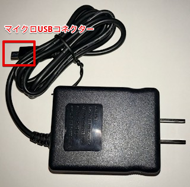
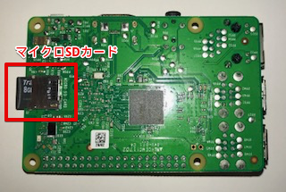
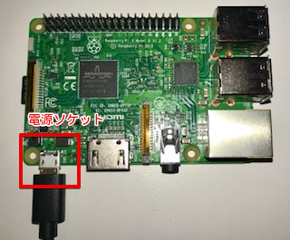
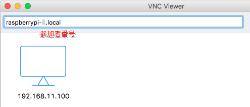
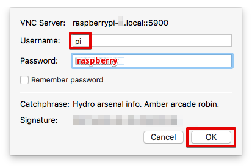
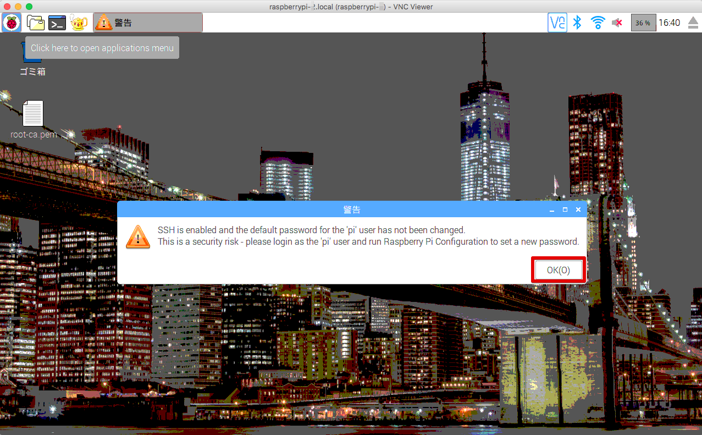
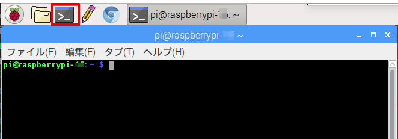
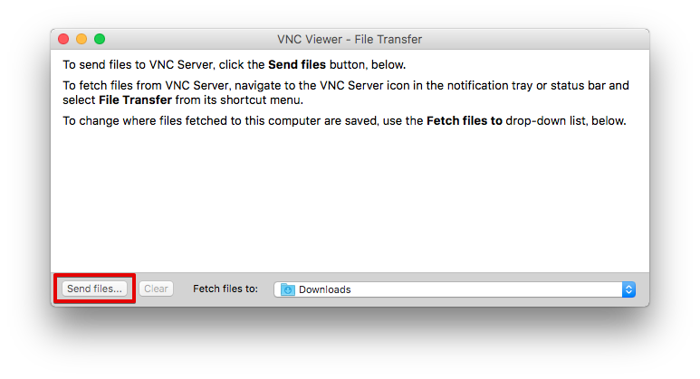

======================
Raspberry Piの設定
======================

ハードウェアの確認
=======================

下記の３つのハードウエアを確認して下さい。

① Raspberry Pi 3

.. image:: images/04/RaspberryPi3.jpg

|

② 電源アダプタ

|

③ マイクロSDカード

.. image:: images/04/SDCard.png

|

参加者番号の紙が入っています。確認して下さい。

組み立て
===================

SDカードをRaspberry Piに装着します。向きがあるので注意して下さい。

|

電源プラグをマイクロUDBソケットに差し込みます。

|

電源を投入すると、SDカードスロット右の赤LEDが点灯します。OSブートが始まり、SDカードへのアクセスがあると、、緑LEDが点滅します。

WiFi接続
===================================

お手持ちのPCをハンズオンのWiFiアクセスポイントに接続します。WiFi設定は、下記になります。

::

- SSID：awshandson
- パスフレーズ：awshandson

|

お手持ちのPCにインストールした、VNC Viewer を起動して下さい。下記の画面が表示されます。

接続先として、'raspberrypi-<参加者番号>.local'と入力して[Enter]を押します。

「一人で1つのAWSアカウントを利用する場合は「参加者番号」は "01" としてください。」
としていましたが、ここでの<参加者番号>は、SDカードに書かれた番号にして下さい・。

|

Username と、Password を入力して [OK] を押します。

|

無事、Raspberry Piに接続出来たら、Raspberry Piのリモート画面が表示されます。

|

警告が出ますが、無視して、[OK] を押して下さい。

Raspberry Piは、WiFi SSID = awshandson に接続するように設定してあります。
VNC Viewerでの接続ができれば、Raspberry PiもWiFiに接続出来ているはずです。

うまく接続出来ない場合は、Ethernet接続を試してみましょう。
Raspberry PiのEthernetは、固定IPアドレス 192.168.11.100 に設定されています。
PCとRaspberry PiをEthernetで接続し(ストレートケーブルでも構いません。)

PC側のIPアドレスを、固定IP 192.168.11.xxx に設定して下さい。
VNC Viewerの接続先を、192.168.11.100 にして、接続してみてください。

シリアルケーブルでコンソール接続する場合、下記のファイルにWiFi設定が入っていますので、適宜変更して下さい。

::

   /etc/wpa_supplicant/wpa_supplicant.conf

|

Raspberry Piの環境を初期化する
====================================

コンソールを表示
------------------------

コンソールは、メニューバーのアイコンをクリックすると表示されます。

|

コンソールに下記を入力し、greengrassとAWS IoT Device SDKの環境、及び証明書をクリーンアップします。

::

   ./handson_cleanup
   rm ~/Desktop/*-certificate.pem.crt
   rm ~/Desktop/*-private.pem.key

|

ダウンロード済みの証明書をRaspberry Piにコピー
============================================================

センサーデバイス、アラートデバイス用に証明書を2セットダウンロードしていました。
Raspberry Piに転送、します。VNC Viewrのタイトルバーの中心にマウスを移動させると、ツールが表示されます。矢印が交差したアイコンをクリックします。

.. image:: images/04/file-txfer.png

|

ファイル転送の画面が表示されます。 [Send files...] ボタンを押します。

|

ファイルの選択画面が表示されるので、全ての証明書を選択して、[Open] を押します。(図は6つのファイル転送していますが、ここでは4つのファイルを転送します)

.. image:: images/04/file-txfer-3.png

|

ファイルがRaspberry Piのデスクトップに転送されます。

.. image:: images/04/file-txfer-done.png

|

設定のおさらい、

ここで、設定のおさらいをしてみましょう。Raspberry Piの設定のために記録した内容は、下記の様になっているはずです。この内容をテキストファイルにして、Raspberry Piに転送しておきましょう。PC側でコピーしてVNCの画面にペーストすることも出来ますが、うまくいかないこともあり、ファイルを転送することをお勧めします。(cleanupスクリプトで削除するために、拡張子は.txtとしてください。)

::

  AWS IoT endpoint
    "endpoint": "xxxxxxxxxxxx.iot.us-west-2.amazonaws.com"

  Alarm Device: Alert-<参加者番号>
    "device_certificate_relative_path": "yyyyyyyyyy-certificate.pem.crt",
    "device_private_key_relative_path": "yyyyyyyyyy-private.pem.key",

  Sensor Device: Sensor-<参加者番号>
    "device_certificate_relative_path": "zzzzzzzzzz-certificate.pem.crt",
    "device_private_key_relative_path": "zzzzzzzzzz-private.pem.key",

|

Raspberry Pi上のファイル
===============================

Raspbery Piのメニューバーをクリックしてファイラーを開きます。
/home/pi以下に下記ファイルがあります。

- aws-iot-greengrass-handson-basic.tar.gz
  本ハンズオンで利用する、センサーデバイス、アラートデバイスのアプリが入っています。

下記のコマンドで解凍して GGhandsonパッケージを解凍して下さい。

::

  tar -zxf ./aws-iot-greengrass-handson-basic.tar.gz -C .

|

デバイスの設定と起動
==================================

アラートデバイス、センサーデバイスは、AWS IoT Device SDK Pythonで作成します。今回のハンズオンでは、Device SDKの開発環境と、各デバイスのコードは、導入済みです。証明書を所定のパスにコピーし、アプリケーションを実行します。

アラートデバイス及びセンサーデバイスの設定と起動は、~/aws-iot-greengrass-handson-basic で行います。

デバイス用の証明書をコピー
----------------------------------

~/aws-iot-greengrass-handson-basic にアラートデバイス用の証明書をコピーして下さい。

コピーするファイルは、デスクトップ上の下記の2つのファイルになります。

- yyyyyyyyyy-certificate.pem.crt
- yyyyyyyyyy-private.pem.key

同様に~/aws-iot-greengrass-handson-basic にセンサーデバイス用の証明書をコピーして下さい。

コピーするファイルは、デスクトップ上の下記の2つのファイルになります。

- zzzzzzzzzz-certificate.pem.crt
- zzzzzzzzzz-private.pem.key

また、~/aws-iot-greengrass-handson-basicには、root-ca.pemが事前に配置されています。
こちらはAWS IoTのサーバ証明書となっており、各デバイスがAWS IoTに接続するために必要になります。

- root-ca.pem

※ 本証明書はサイトからダウンロードすることが可能です。詳細は下記を参照して下さい。

http://docs.aws.amazon.com/ja_jp/iot/latest/developerguide/managing-device-certs.html
