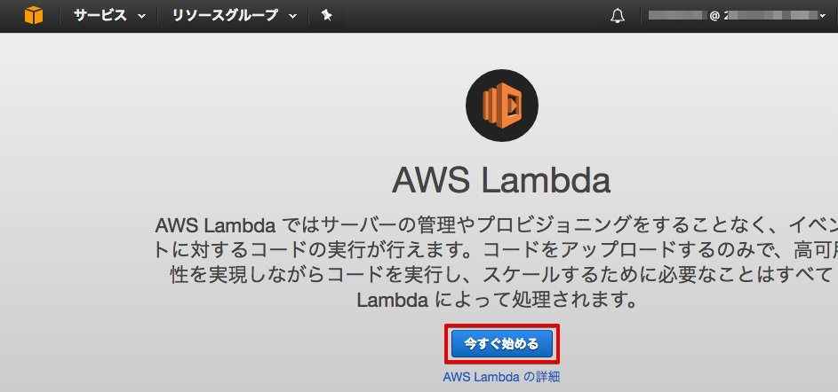
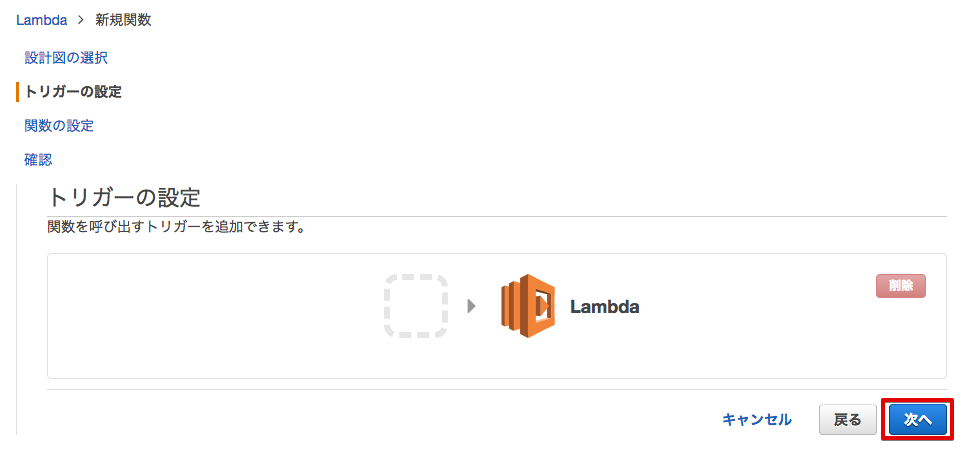

==================================================================
Greengrass向けLambda関数の登録とサブスクリプションの設定
==================================================================

Lambda関数の登録
=======================

Greengrassコアにデプロイする Lambda関数を登録します。

はじめに、Lambda関数パッケージを下記のリンクからPCにダウンロードして下さい。このzipファイルは、後ほどLambdaの設定画面でアップロードします。

https://s3-us-west-2.amazonaws.com/greengrass-trial/GGhandsonLambda.zip

このパッケージは、Lambda関数(greengrassCpuUsage.py)の他に、AWS Greengrass コア Python SDKが含まれています。
このSDKは、Lambda関数は実行中にGreengrassコアとの通信を可能にします。

サービス一覧から[Lambda] をクリックして開きます。

.. image:: images/04/lambda.png

|

下記のような画面が表示されるので、[今すぐ始める] をクリックします。

|

Lambda関数の作成画面が表示されるので、"Blank Function" をクリックします。

.. image:: images/04/lambda-3.png

|

トリガーの設定画面が表示されるので、[次へ]をクリックします。

|

ダウンロード済みのLambda関数パッケージ(GGhandsonLambda.zip)をアップロードします。
下記のような画面が表示されるので、必要事項を入力して下さい。

======================== =======================================
項目                        設定
======================== =======================================
名前                          greengrassCpuUsage-<参加者番号>
説明                          ALambda func. to run Greengrass core
ランタイム                     Python 2.8
コード エントリ タイプ           .ZIPファイルをアップロード
関数パッケージ                  GGhandsonLambda.zip
ハンドラ                       greengrassCpuUsage.message_handler
ロール                         カスタムロールの作成
======================== =======================================

|

ロール：[カスタムロールの作成] を選択すると、別画面でIAMの設定画面が出てきます。[許可] をクリックするとIAMの設定画面は閉じます。

|

Lambdaの画面に戻ります。ロールが [既存のロールを選択] に変更され、ロール名として、"lambda_basic_execution" になって居居ることを確認し、[次へ] をクリックして下さい。

|

確認画面が表示されますので、下までスクロースし、[関数の作成] をクリックして下さい。

.. image:: images/04/lambda-create.png

|

Lambda関数の作成に成功すると、下記の様な画面が表示されます。

|

Lambda関数のバージョンを設定します。[アクション ▼] メニューから、[新しいバージョンを発行] をクリックします。

.. image:: images/04/lambda-version.png

|

[バージョンの説明] に、"Handson" と入力し、[発行] をクリックします。

.. image:: images/04/lambda-version-2.png

|

Lambda関数の登録は、終了です。

サブスクリプションの設定
==========================

サブスクリプションは、メッセージの送信先を定義するものです。今回のハンズオンでは、下記のサブスクリプションを設定します。

Greengrassの設定画面に戻り、Greengrassグループ：GGHandsonGroup-<参加者番号>　をクリックして下さい。

.. image:: images/04/greengrass-group.png

|
