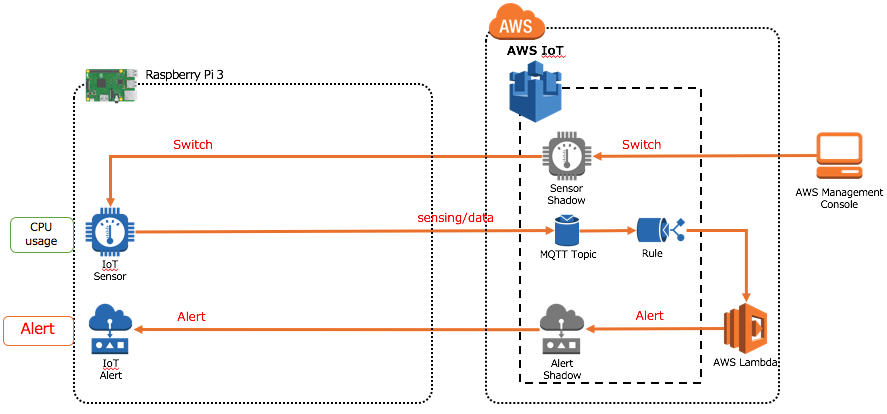
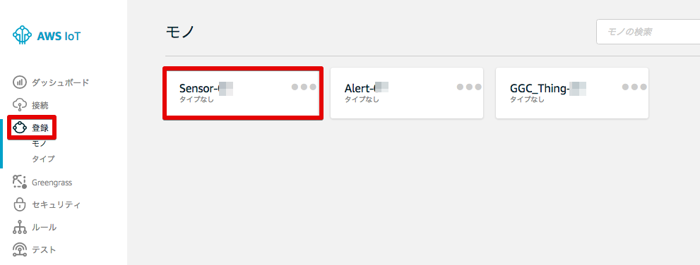
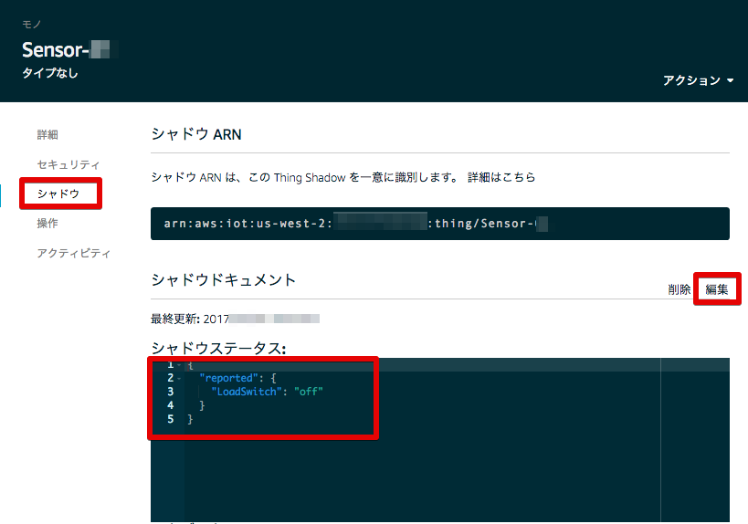
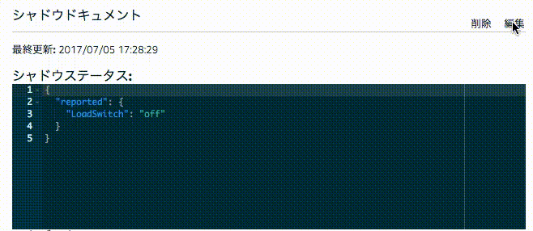
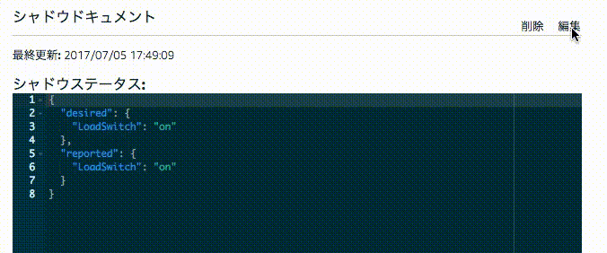

=======================================
アプリケーションの動作確認
=======================================

アプリケーションを実際に動かして、動作を確認します。
本ハンズオンでは、センサーデバイスはRaspberry Pi上のCPU使用率を定期的にAWS IoTのsensing/dataにuploadし、これをトリガーに実行されたlambda関数がCPU使用率を確認、閾値を超える、もしくは下回るとアラートデバイスのalertのon/offを切り替えます。

本ハンズオンでは、センサーデバイスのCPU使用率を制御するため、センサーデバイスは、高負荷の処理を実行するswitchをシャドウとして保持します。このswitchをonにすることで、センサーデバイスを閾値を超える高負荷状態にすることができます。

|

デバイスの起動
=================

アラートデバイスを起動する
-----------------------------

コンソールを開き、下記を入力して、アラートデバイスを起動します。

::

  cd GGHandson/alert_device
  python ./ThingShadowAlarm.py -e xxxxxxxxxxxx.iot.us-west-2.amazonaws.com -r root-ca.pem -c yyyyyyyyyy-certificate.pem.crt -k yyyyyyyyyy-private.pem.key -n Alert-<参加者番号> -id Alert-<参加者番号>

|

各実行パラメータの説明は以下になります。

.. csv-table::
    :header-rows: 1
    :file: table/alert_device_option.csv

|

アラートデバイスは、デバイスシャドウ のキー Alert の更新を待ち続けます。

エラーが出る場合、オプションに指定したパラメータが正しいか、モノに証明書がアタッチされているか、証明書にポリシーがアタッチされているか、ポリシーの内容は適切か、再度確認して下さい。

センサーデバイスを起動する
-----------------------------

新規にコンソールを開き、下記を入力して、アラートデバイスを起動します。

::

  cd GGHandson/sensor_device
  python ./ThingShadowSensor.py -e xxxxxxxxxxxx.iot.us-west-2.amazonaws.com -r root-ca.pem -c zzzzzzzzzz-certificate.pem.crt -k zzzzzzzzzz-private.pem.key -n Sensor-<参加者番号> -id Sensor-<参加者番号> -t sensing/data/Sensor-<参加者番号>

|

各実行パラメータの説明は以下になります。

.. csv-table::
    :header-rows: 1
    :file: table/sensor_device_option.csv

|

センサーデバイスは、Raspberry PiのCPUロードをトピック sensing/data にPublishし続けます。

エラーが出る場合、オプションに指定したパラメータが正しいか、モノに証明書がアタッチされているか、証明書にポリシーがアタッチされているか、ポリシーの内容は適切か、再度確認して下さい。

この時点で、アラートデバイスとセンサーデバイス の2つのソフトウェアが同時に起動していることになります。

動作確認
===========================

AWS コンソールのAWS IoT に移動します。

メニューから [登録] をクリックし、センサーデバイスをクリックします。

|

メニューから、[シャドウ] をクリックし、センサーデバイスのシャドウを表示します。

|

"LoadSwitch": "off" の状態では、CPUロードは、数% 程度です。CPUロードを上げてみましょう。

右上の [編集] をクリックして、下記の様に書き換えて下さい。

::

  {
    "desired": {
      "LoadSwitch": "on"
    }
  }

|

その後、右上の [保存] をクリックして下さい。クラウド上の "LoadSwitch" センサーデバイスのシャドウと同期し、"reported"の"LoadSwitch"が"on" になります。

|

Raspberry Piのリモート画面を見て下さい。

センサーデバイスが、"LoadSwitch" の状態が "on" になったことを認識し、内部でCPU負荷のかかる計算を実行します。
その結果、Raspberry PiのCPU usageが 70% 程度に上がります。
AWS IoTのsensing/data トピックにデータがinputされると、Lambdaが実行されており、Lambda関数内の処理でCPU負荷が閾値を上回るとアラートデバイスのシャドウ "Alert"を "on"に更新します。アラートデバイスが、"Alert": "on" を確認すると、アラートデバイス アプリが、“!!!!!alert!!!!!" と表示します。

続いて、AWS IoTのコンソールで、"desired"内の”LoadSwitch"を "off"にしてみて下さい。

|

センサーデバイスはシャドウの変更を受けて計算を終了し、その結果Lambdaがアラートデバイスのシャドウ"Alert"を"off"に更新するため、アラートデバイスの "!!!!!alert!!!!!" 表示は停止します。

これでAWS IoTを介して、センサーデバイスとアラートデバイスが連携できていることを確認しました。

アラートデバイス、センサーデバイスそれぞれのアプリケーションをCtl-Cで終了して下さい。
