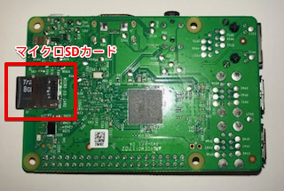
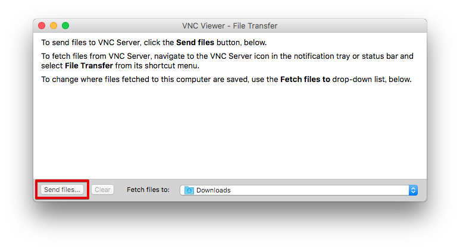
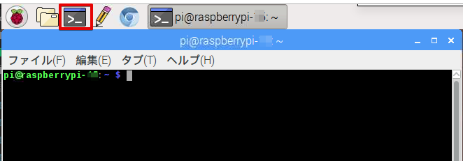

======================
Raspberry Piの設定
======================

ハードウェアの確認
=======================

下記の３つのハードウエアを確認して下さい。

① Raspberry Pi 3

|

② 電源アダプタ

|

③ マイクロSDカード

.. image:: images/05/SDCard.png

|

参加者番号の紙が入っています。確認して下さい。

組み立て
===================

SDカードをRaspberry Piに装着します。向きがあるので注意して下さい。

|

電源プラグをマイクロUDBソケットに差し込みます。

.. image:: images/05/USB-Plug-in.png

|

電源を投入すると、SDカードスロット右の赤LEDが点灯します。OSブートが始まり、SDカードへのアクセスがあると、、緑LEDが点滅します。

WiFi接続
===================================

お手持ちのPCをハンズオンのWiFiアクセスポイントに接続します。WiFi設定は、下記になります。

::

- SSID：awshandson
- パスフレーズ：awshandson

|

お手持ちのPCにインストールした、VNC Viewer を起動して下さい。下記の画面が表示されます。

接続先として、'raspberrypi-<参加者番号>.local'と入力して[エンター]を押します。

|

Username と、Password を入力して [OK] を押します。

.. image:: images/05/VNC_Connect.png

|

無事、Raspberry Piに接続出来たら、Raspberry Piのリモート画面が表示されます。

.. image:: images/05/VNC_login-OK.png

|

警告が出ますが、無視して、[OK] を押して下さい。

Raspberry Piは、WiFi SSID = awshandson に接続するように設定してあります。
VNC Viewerでの接続ができれば、Raspberry PiもWiFiに接続出来ているはずです。

うまく接続出来ない場合は、Ethernet接続を試してみましょう。
Raspberry PiのEthernetは、固定IPアドレス 192.168.11.100 に設定されています。
PCとRaspberry PiをEthernetで接続し(ストレートケーブルでも構いません。)

PC側のIPアドレスを、192.168.11.xxx に設定して下さい。
VNC Viewerの接続先を、192.168.11.100 にして、接続してみてください。

ダウンロード済みの証明書をRaspberry Piにコピー
============================================================

Greengrassコア、センサーデバイス、アラートデバイス用に証明書を３セットダウンロードしていました。
Raspberry Piに転送、します。VNC Viewrのタイトルバーの中心にマウスを移動させると、ツールが表示されます。矢印が交差したアイコンをクリックします。

.. image:: images/05/file-txfer.png

|

ファイル転送の画面が表示されます。 [Send files...] ボタンを押します。

|

ファイルの選択画面が表示されるので、全ての証明書を選択して、[Open] を押します。

|

ファイルがRaspberry Piのデスクトップに転送されます。

|

設定のおさらい、

ここで、設定のおさらいをしてみましょう。Raspberry Piの設定邸のために記録した内容は、下記の様になっているはずです。この内容をテキストファイルにして、Raspberry Piに転送しておきましょう。PC側でコピーしてVNCの画面にペーストすることも出来ますが、うまくいかないこともあり、ファイルを転送することをお勧めします。

::

  Greengrass core device: GGC_Thing-01
    "certPath": "xxxxxxxxxx-certificate.pem.crt",
    "keyPath": "xxxxxxxxxx-private.pem.key",
    "thingArn": "arn:aws:iot:us-west-2:000000000000:thing/GGC_Thing-01"

  AWS IoT endpoint
    "endpoint": "xxxxxxxxxxxx.iot.us-west-2.amazonaws.com"

  Alarm Device: Alert-01
    "device_certificate_relative_path": "certs/handsonAlarm/yyyyyyyyyy-certificate.pem.crt",
    "device_private_key_relative_path": "certs/handsonAlarm/yyyyyyyyyy-private.pem.key",

  Sensor Device: Sensor-01
    "device_certificate_relative_path": "certs/handsonSensor/zzzzzzzzzz-certificate.pem.crt",
    "device_private_key_relative_path": "certs/handsonSensor/zzzzzzzzzz-private.pem.key",

|

Raspberry Pi 上の設定ファイルは、下記の3つになります。

- Greengrassコアの設定
  /greengrass/configuration/config.json
- センサーデバイスの設定
  /aws-iot-device-sdk-cpp/common/HandsonSensorConfig.json
- アラートデバイスの設定
  /aws-iot-device-sdk-cpp/common/HandsonAlarmConfig.json

Raspberry Pi上のファイル
===============================

Raspbery Piのメニューバーをクリックしてファイラーを開きます。

.. image:: images/05/files-on-raspi.png

|

- aws-iot-device-sdk-cpp
  AWS IoT Device SDK C++ のパスです。センサーデバイス、アラートデバイスのアプリが存在します。
  証明書を格納するパスや、設定ファイル、アプリのソースコードが入っています。
- greengrass
  AWS Greengrass のパスです。
  証明書を格納するパスや、設定ファイル、Greengrassコアが入っています。
  greengrass/ パスが無い場合は、/home/pi/にARMv7版のgreengrassパッケージがありますので、下記のコマンドで解凍して下さい。

::

  tar -zxf greengrass-linux-x86-64-1.0.0.tar.gz -C .

|

コンソールを表示
------------------------

コンソールは、メニューバーのアイコンをクリックすると表示されます。

|

Greengrassコアの設定と起動
==================================

Greengrassコアの設定は、/home/pi/greengrass/configuration で行います。

|

Greengrassコア用の証明書をコピー
----------------------------------

/home/pi/greengrass/configuration/certs にGreengrassコア用の証明書をコピーして下さい。

コピーするファイルは、デスクトップ上の下記の３つのファイルになります。

- root-ca.pem
- xxxxxxxxxx-certificate.pem.crt
- xxxxxxxxxx-private.pem.key

設定ファイルの修正
---------------------------

/home/pi/greengrass/configuration/config.json をダブルクリックします。Text Editorが開きます。

|

赤線の部分を書き換えて下さい。

::

  {
      "coreThing": {
          "caPath": "root-ca.pem",
          "certPath": "xxxxxxxxxx-certificate.pem.crt",
          "keyPath": "xxxxxxxxxx-private.pem.key",
          "thingArn": "arn:aws:iot:us-west-2:000000000000:thing/GGC_Thing-01",
          "iotHost": "xxxxxxxxxxxx.iot.us-west-2.amazonaws.com",
          "ggHost": "greengrass.iot.us-west-2.amazonaws.com"
      },
      "runtime": {
          "cgroup": {
              "useSystemd": "yes"
          }
      }
  }

|

"iotHost"は、AWS IoTのエンドポイント(endpoint)です。

"ggHost"のリージョン(AWS_REGION_HERE)も、us-west-2に書き換えて下さい。"useSystemd"は、yesにして下さい。

Greengrassを起動する
-----------------------------

コンソールを開き、下記を入力して、Greengrassを起動します。

::

  cd greengrass
  sudo ./greengrassd start

|

Greengrassが正常に起動できれば、下記が表示されます。

.. image:: images/05/greengrass-start.png

|

デバイスの設定とビルド
==================================

センサーデバイス、アラートデバイスは、AWS IoT Device SDK C++で作成します。今回のハンズオンでは、Device SDKの開発環境と、各デバイスのコードは、導入済みです。証明書を所定のパスにコピーし、設定ファイルを修正し、アプリケーションのビルドを行います。

デバイスの用の証明書をコピー
----------------------------------

/home/pi/aws-iot-device-sdk-cpp/certs にDevice SDK用の証明書のパスがあります。

|

アラートデバイス用の証明書は、handsonAlarm、センサーデバイス用の証明書は、handsonSensorにコピーして下さい。

root-ca.pem は、既に、コピー済みです。

/home/pi/aws-iot-device-sdk-cpp/certs/handsonAlarm にコピー

- yyyyyyyyyy-certificate.pem.crt
- yyyyyyyyyy-private.pem.key

/home/pi/aws-iot-device-sdk-cpp/certs/handsonSensor にコピー

- zzzzzzzzzz-certificate.pem.crt
- zzzzzzzzzz-private.pem.key

設定ファイルの修正
---------------------------

設定ファイルは、下記になります。

- /home/pi/aws-iot-device-sdk-cpp/common/HandsonAlarmConfig.json
- /home/pi/aws-iot-device-sdk-cpp/common/HandsonSensorConfig.json

Text Editorで開いて下さい。

.. image:: images/05/greengrass-device-settings.png

|

**アラートデバイス用設定ファイル：HandsonAlarmConfig.json**

赤字の部分を書き換えて下さい。

"client_id"、"thing_name"は、アラートデバイス名 Alert-<参加者番号>　になります。

**センサーデバイス用設定ファイル：HandsonSensorConfig.json**

同様に、赤字の部分を書き換えて下さい。

|

Device SDKアプリケーションのビルド
-----------------------------------------

センサーデバイス、アラートデバイス用アプリケーションのビルドを行います。コンソ-ルを開き、~/aws-iot-device-sdk-cpp/build に移動して下さい。

|

下記を入力し、リターンを押します。アラートデバイス用アプリがビルドされます。

::

  make handson-alarm-sample

|

ビルに成功すると、下記の様に表示されます。

|

~/aws-iot-device-sdk-cpp/build/bin 内に、実行ファイル handson-alarm-sample が生成されていることを確認します。

|

同様に、センサーデバイス用の用アプリもビルドします。

::

  make handson-sensor-sample

|

~/aws-iot-device-sdk-cpp/build/bin 下に、実行ファイル handson-sensor-sample が生成されていることを確認します。

/home/pi/aws-iot-device-sdk-cpp/build/bin/certs 下に、証明書がコピーされているかも確認してください。

|
