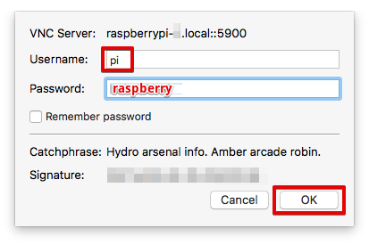
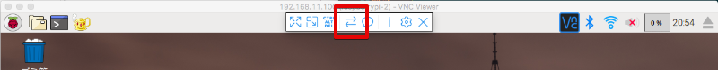

======================
Raspberry Piの設定
======================

ハードウェアの確認
=======================

下記の３つのハードウエアを確認して下さい。

① Raspberry Pi 3

.. image:: images/05/RaspberryPi3.jpg

|

② 電源アダプタ

.. image:: images/05/PowerAddapter.png

|

③ マイクロSDカード

|

参加者番号の紙が入っています。確認して下さい。

組み立て
===================

SDカードをRaspberry Piに装着します。向きがあるので注意して下さい。

.. image:: images/05/SDCard-2.png

|

電源プラグをマイクロUDBソケットに差し込みます。

.. image:: images/05/USB-Plug-in.png

|

電源を投入すると、SDカードスロット右の赤LEDが点灯します。OSブートが始まり、SDカードへのアクセスがあると、、緑LEDが点滅します。

WiFi接続
===================================

お手持ちのPCをハンズオンのWiFiアクセスポイントに接続します。WiFi設定は、下記になります。

::

- SSID：awshandson
- パスフレーズ：awshandson

|

お手持ちのPCにインストールした、VNC Viewer を起動して下さい。下記の画面が表示されます。

接続先として、'raspberrypi-<参加者番号>.local'と入力して[エンター]を押します。

.. image:: images/05/VNC_Viewer.png

|

Username と、Password を入力して [OK] を押します。

|

無事、Raspberry Piに接続出来たら、Raspberry Piのリモート画面が表示されます。

.. image:: images/05/VNC_login-OK.png

|

Raspberry Piは、WiFi SSID = awshandson に接続するように設定してあります。
VNC Viewerでの接続ができれば、Raspberry PiもWiFiに接続出来ているはずです。

うまく接続出来ない場合は、Ethernet接続を試してみましょう。
Raspberry PiのEthernetは、固定IPアドレス 192.168.11.100 に設定されています。
PCとRaspberry PiをEthernetで接続し(ストレートケーブルでも構いません。)

PC側のIPアドレスを、192.168.11.xxx に設定して下さい。
VNC Viewerの接続先を、192.168.11.100 にして、接続してみてください。

ダウンロード済みの証明書をRaspberry Piにコピー
============================================================

Greengrassコア、センサーデバイス、アラートデバイス用に証明書を３セットダウンロードしていました。
Raspberry Piに転送、します。VNC Viewrのタイトルバーの中心にマウスを移動させると、ツールが表示されます。矢印が交差したアイコンをクリックします。

|

ファイル転送の画面が表示されます。 [Send files...] ボタンを押します。

.. image:: images/05/file-txfer-2.png

|

ファイルの選択画面が表示されるので、全ての証明書を選択して、[Open] を押します。

.. image:: images/05/file-txfer-3.png

|

ファイルがRaspberry Piのデスクトップに転送されます。

.. image:: images/05/file-txfer-done.png

|

設定のおさらい、

ここで、設定のおさらいをしてみましょう。Raspberry Piの設定邸のために記録した内容は、下記の様になっているはずです。

::

  Greengrass core device: GGC_Thing-01
    "certPath": "xxxxxxxxxx-certificate.pem.crt",
    "keyPath": "xxxxxxxxxx-private.pem.key",
    "thingArn": "arn:aws:iot:us-west-2:000000000000:thing/GGC_Thing-01"

  AWS IoT endpoint
    "endpoint": "xxxxxxxxxxxx.iot.us-west-2.amazonaws.com"

  Alarm Device: Alert-01
    "device_certificate_relative_path": "certs/handsonAlarm/yyyyyyyyyy-certificate.pem.crt",
    "device_private_key_relative_path": "certs/handsonAlarm/yyyyyyyyyy-private.pem.key",

  Sensor Device: Sensor-01
    "device_certificate_relative_path": "certs/handsonSensor/zzzzzzzzzz-certificate.pem.crt",
    "device_private_key_relative_path": "certs/handsonSensor/zzzzzzzzzz-private.pem.key",

|

Raspberry Pi 上の設定ファイルは、下記の3つになります。

- Greengrassコアの設定
  /greengrass/configuration/config.json
- センサーデバイスの設定
  /aws-iot-device-sdk-cpp/common/HandsonSensorConfig.json
- アラートデバイスの設定
  /aws-iot-device-sdk-cpp/common/HandsonAlarmConfig.json

Raspberry Pi上のファイル
===============================

Raspbery Piのメニューバーをクリックしてファイラーを開きます。

.. image:: images/05/files-on-raspi.png

|

- aws-iot-device-sdk-cpp
  AWS IoT Device SDK C++ のパスです。センサーデバイス、アラートデバイスのアプリが存在します。
  証明書を格納するパスや、設定ファイル、アプリのソースコードが入っています。
- greengrass
  AWS Greengrass のパスです。
  証明書を格納するパスや、設定ファイル、Greengrassコアが入っています。

アラートデバイス用の証明書
-------------------------------

/home/pi/aws-iot-device-sdk-cpp/certs

証明書を所定の位置にコピー
================================
