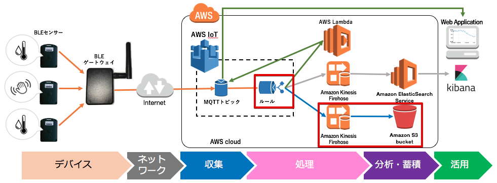

=======================================
Greengrassコアへのデプロイと動作確認
=======================================

ゲートウェイは、温湿度センサーが送信するBeaconを受信し、定期的にAWS IoTに送信します。AWS IoTではルールに基づきKinesis Firehoseにデータを送り、Kinesis Firehoseは、受け取ったデータをLambda関数で加工し、S3に保存します。

|

S3に保存されるデータは、下記のJSON形式になります。

::

  {
    "model": "590080BC",       ← センサーのモデル番号
    "src_mac": "FFEAD7E638B8", ← センサーのMACアドレス
    "dst_mac": "AC83F3A041D2", ← ゲートウェイのMACアドレス
    "rssi": -47,               ← Beaconの電波強度
    "vbat": 3.34,              ← 電池電圧
    "tempreature": 26.97,      ← 温度
    "humidity": 42,            ← 湿度
    "@timestamp": "2017-05-11T08:34:43" ← タイムスタンプ
  }

|
