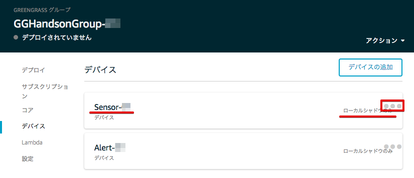

================================================================
デバイスをGreengrassグループに追加する
================================================================

センサーデバイス、アラートデバイスをGreengrassコアに接続するため、必要な権限の追加、Greengrass Groupへの追加を行います。

.. image:: images/07/overview-gg-thing.png

|

ポリシーの変更(アラートデバイス)
==========================

アラートデバイス(用の証明書)に付与するポリシーにGreengrassへの権限を追加します。

AWS IoTのメニューから[セキュリティー]＞[ポリシー]をクリックします。
一覧が表示されますので、Alert-<参加者番号>-policyを選択して下さい。

|

アラートデバイス用の証明書に付与するポリシーを編集します。
[ポリシードキュメントの編集]をクリックし、下記で上書きして下さい。
既存のポリシーに、Greengrass全般の権限を追加しています。

|

**ポリシードキュメント(変更前)**

::

  {
    "Version": "2012-10-17",
    "Statement": [
      {
        "Effect": "Allow",
        "Action": "iot:*",
        "Resource": "*"
      }
    ]
  }

|

**ポリシードキュメント(変更後)**

::

  {
    "Version": "2012-10-17",
    "Statement": [
      {
        "Effect": "Allow",
        "Action": "iot:*",
        "Resource": "*"
      },
      {
        "Effect": "Allow",
        "Action": "greengrass:*",
        "Resource": "*"
      }
    ]
  }

|

編集後、[新しいバージョンとして保存。]をクリックして更新します。

|

アラートデバイスのポリシーにGreengrassの権限が追加されました。

|

※ 今回のハンズオンでは簡易化のため、アラートデバイスがAWS Greengrassにおける全アクションを全リソースに対して行えるポリシーを付与しますが、実際に使用する場合は、デバイスが必要とするアクションとリソースに制限することを検討して下さい。

ポリシーの変更(センサーデバイス)
==========================

センサーデバイス(用の証明書)に付与するポリシーにGreengrassへの権限を追加します。

AWS IoTのメニューから[セキュリティー]＞[ポリシー]をクリックします。
一覧が表示されますので、Sensor-<参加者番号>-policyを選択して下さい。

|

センサーデバイス用の証明書に付与するポリシーを編集します。
[ポリシードキュメントの編集]をクリックし、下記で上書きして下さい。
既存のポリシーに、Greengrass全般の権限を追加しています。

|

**ポリシードキュメント(変更前)**

::

  {
    "Version": "2012-10-17",
    "Statement": [
      {
        "Effect": "Allow",
        "Action": "iot:*",
        "Resource": "*"
      }
    ]
  }

|

**ポリシードキュメント(変更後)**

::

  {
    "Version": "2012-10-17",
    "Statement": [
      {
        "Effect": "Allow",
        "Action": "iot:*",
        "Resource": "*"
      },
      {
        "Effect": "Allow",
        "Action": "greengrass:*",
        "Resource": "*"
      }
    ]
  }

|

編集後、[新しいバージョンとして保存。]をクリックして更新します。

|

センサーデバイスのポリシーにGreengrassの権限が追加されました。

|

※ 今回のハンズオンでは簡易化のため、センサーデバイスがAWS Greengrassにおける全アクションを全リソースに対して行えるポリシーを付与しますが、実際に使用する場合は、デバイスが必要とするアクションとリソースに制限することを検討して下さい。

デバイスをGreengrassグループに追加する
=========================================

作成した、センサーデバイス、アラートデバイスをGreengrassグループに追加します。

Greengrassの設定画面に戻り、Greengrassグループ：GGHandsonGroup-<参加者番号> をクリックして下さい。

.. image:: images/07/greengrass-group.png

|

メニューから [デバイス] をクリックします。以下の様な画面が表示されますので、[デバイスの追加] をクリックします。

.. image:: images/07/add-thing-to-group.png

|

[IoT Thingを選択する] をクリックします。

|

アラートデバイス：Alert-<参加者番号> にチェックを入れ、[完了] をクリックします。

.. image:: images/07/add-thing-to-group-3.png

|

アラートデバイスが追加されました。[デバイスの追加] をクリックして、センサーデバイスも追加します。

|

センサーデバイス、アラートデバイスをGreengrassグループに追加されました。

|

センサーデバイスのデバイス シャドウは、クラウド上のシャドウと同期させる必要があるので、設定を変更します。

センサーデバイスの右の [●●●] をクリックして、[クラウドに同期] をクリックして下さい。

|

[クラウドへのシャドウ同期] に変更されました。

.. image:: images/07/sync-thing-shadow-3.png

|
