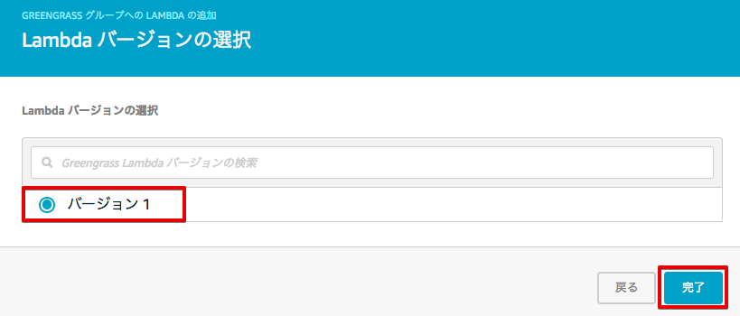
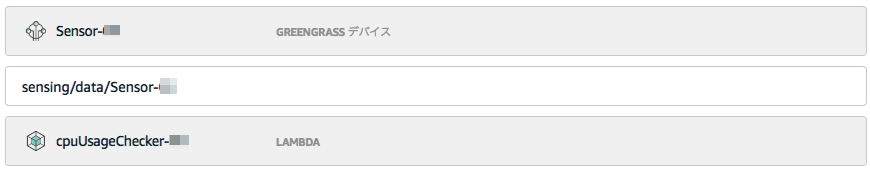
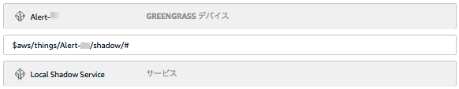

==================================================================
Greengrass向けLambda関数の更新とサブスクリプションの設定
==================================================================

クラウド上で動作させていたlambda関数をGreengrassコアにデプロイ、動作できるよう更新します。

|

AWS IoT Lambdaルールの無効化
=======================

クラウド上で動作させていたlambda関数を、無効化します。
AWS IoTのメニューから[ルール]をクリックします。
一覧が表示されますので、cpuUsageRule-<参加者番号>を選択して下さい。

|

[アクション]をクリックし、プルダウンメニューから[無効化]をクリックして下さい。

|

ルールが無効化されました。

|

Lambda関数の更新
=======================

Lambda関数をGreengrassコアにデプロイ、動作できるよう更新します。

サービス一覧から[Lambda] をクリックして開きます。

.. image:: images/08/lambda.png

|

Lambda関数一覧が表示されます。
先ほど作成したcpuUsageChecker-<参加者番号>を選択します。

.. image:: images/08/lambda-list.png

|

コードをインラインで編集します。
boto3の代わりにgreengrasssdkを利用するよう、修正して下さい。
このSDKは、Greengrassコアとの通信を可能にします。

|

|

**コード(変更前)**

::

  import sys
  import logging
  import json
  import boto3
  # import greengrasssdk

  # Setup logging to stdout
  logger = logging.getLogger(__name__)
  logging.basicConfig(stream=sys.stdout, level=logging.DEBUG)

  client = boto3.client('iot-data')
  # client = greengrasssdk.client('iot-data')

|

**コード(変更後)**

::

  import sys
  import logging
  import json
  # import boto3
  import greengrasssdk

  # Setup logging to stdout
  logger = logging.getLogger(__name__)
  logging.basicConfig(stream=sys.stdout, level=logging.DEBUG)

  # client = boto3.client('iot-data')
  client = greengrasssdk.client('iot-data')

|

コードを変更したら[保存]をクリックして下さい。

|

Lambda関数のバージョンを設定します。[アクション ▼] メニューから、[新しいバージョンを発行] をクリックします。

|

[バージョンの説明] に、"Handson" と入力し、[発行] をクリックします。

|

これで、Lambda関数の登録は、終了です。

次に、このLambda関数をGreengrassクループに追加します。

Greengrassの設定画面に戻り、[Greengrass] > [グループ]をクリックし、
一覧からGGHandsonGroup-<参加者番号> を選択して下さい。

.. image:: images/08/greengrass-group.png

|

メニューから [Lambda] をクリックします。

|

[Lambdaの追加] をクリックします。

|

[]既存のLambdaの使用] をクリックします。

|

[cpuUsageChecker-<参加者番号>] にチェックを入れ、[次へ] をクリックします。

|

先ほど作成したLambda関数のバージョンにチェックを入れ、[次へ] をクリックします。

|

Lambda関数のバージョンが、Greengrassグループに追加されました。

|

シナリオ
==================

今回のハンズオンでは、下記のシナリオでGreengrassの動作を確認します。
動作確認を容易化するため、センシングしたデータはエッジだけでなくクラウドにも送信します。

- ① センサーデバイスが、Raspberry PiのCPUロードを定期的にトピック"sensing/data"にPublish
- ② トピック"sensing/data"をローカルLambdaにも流す
- ③ ローカルLambdaが、CPUロードを確認し、シャドウ "Alert"を更新する
- ④ アラートデバイスは、シャドウ "Alert"がセットされると、アラートを出す
- ⑤ センサー用のシャドウ "LoadSwitch"は、クラウドとSyncする設定にしておき、クラウド側でシャドウを更新すると、センサーデバイスでRaspberry Piに負荷がかかる処理を実行する

|

サブスクリプションの設定
==========================

サブスクリプションは、ローカルデバイス、Greengrassコア、クラウド間のメッセージの送信先を定義するものです。今回のハンズオンでは、下記のサブスクリプションを設定します。

.. csv-table::
    :header-rows: 1
    :file: table/subscription.csv

|

このテーブルに従って、サブスクリプションの設定を行います。

Greengrassの設定画面に戻り、Greengrassグループ：GGHandsonGroup-<参加者番号> をクリックして下さい。

.. image:: images/08/greengrass-group.png

|

メニューから [サブスクリプション] をクリックします。

|

まずは、①のソースのセンサーデバイスを設定します。ソースの [選択] をクリックします。

|

[デバイス] をクリックし、Sensor-<参加者番号> をクリックします。

|

次に、①のターゲットの IoT Cloud を設定します。ターゲットの [選択] をクリックします。

|

[サービス] をクリックし、IoT Cloud をクリックします。

|

[次へ] をクリックします。

|

オプションのトピックのフィルターに sensing/data を入力し、[次へ] をクリックします。

|

確認画面が出てきますので、[完了] をクリックして、設定を保存します。

|

上記の操作を繰り返して、残りのサブスクリプションの設定を行って下さい。

②の設定

|

③の設定

|

④-1の設定

|

④-2の設定

|

⑤-1の設定

.. image:: images/08/subscription-5-1.png

|

⑤-2の設定

.. image:: images/08/subscription-5-2.png

|

最終的には、下記の様になります。

|

トピックが長い場合、入力したフィルター全体が表示されませんが、トピックが隠れている所にマウスポインタを置くと、トピックの隠れていた部分も含めて全体が表示されます。

これで、クラウド側の設定は、終わりです。
