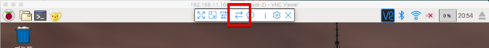
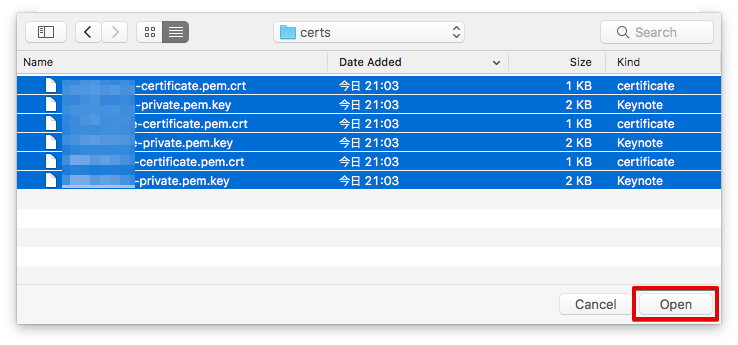
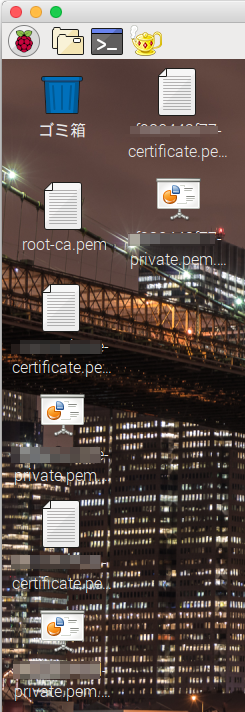
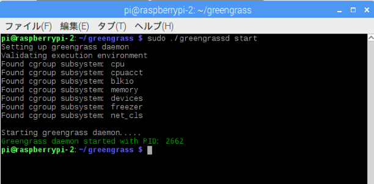

======================
Raspberry Piの設定
======================

ダウンロード済みの証明書をRaspberry Piにコピー(Greengrassコア)
============================================================

Greengrassコアの証明書をダウンロードしていました。
これをRaspberry Piに転送します。VNC Viewrのタイトルバーの中心にマウスを移動させると、ツールが表示されます。矢印が交差したアイコンをクリックします。

|

ファイル転送の画面が表示されます。 [Send files...] ボタンを押します。

.. image:: images/09/file-txfer-2.png

|

ファイルの選択画面が表示されるので、全ての証明書を選択して、[Open] を押します。
(図は6つのファイル転送していますが、ここでは2つのファイルを転送します)

|

ファイルがRaspberry Piのデスクトップに転送されます。

|

設定のおさらい、

ここで、Greengrass 設定のおさらいをしてみましょう。Raspberry Piの設定邸のために記録した内容は、下記の様になっているはずです。この内容をテキストファイルにして、Raspberry Piに転送しておきましょう。PC側でコピーしてVNCの画面にペーストすることも出来ますが、うまくいかないこともあり、ファイルを転送することをお勧めします。

::

  Greengrass core device: GGC_Thing-<参加者番号>
    "certPath": "xxxxxxxxxx-certificate.pem.crt",
    "keyPath": "xxxxxxxxxx-private.pem.key",
    "thingArn": "arn:aws:iot:us-west-2:000000000000:thing/GGC_Thing-01"

|

Greengrassコアの設定ファイルは、下記になります。

- Greengrassコアの設定
  /greengrass/configuration/config.json

Raspberry Pi上のファイル
===============================

Raspbery Piのメニューバーをクリックしてファイラーを開きます。
/home/pi以下に下記ファイルがあります。

- greengrass-linux-armv7l-1.0.0.tar.gz
  ARMv7版のAWS Greengrass パッケージです。
  証明書を格納するパスや、設定ファイル、Greengrassコアが入っています。

下記のコマンドで解凍して Greengrassパッケージを解凍して下さい。

::

  tar -zxf greengrass-linux-armv7l-1.0.0.tar.gz -C .

|

Greengrassコアの設定と起動
==================================

Greengrassコアの設定は、~/greengrass/configuration で行います。

.. image:: images/09/greengrass-core-setting.png

|

Greengrassコア用の証明書をコピー
----------------------------------

~/greengrass/configuration/certs にGreengrassコア用の証明書をコピーして下さい。

コピーするファイルは、デスクトップ上の下記の３つのファイルになります。

- root-ca.pem
- xxxxxxxxxx-certificate.pem.crt
- xxxxxxxxxx-private.pem.key

設定ファイルの修正
---------------------------

~/greengrass/configuration/config.json をダブルクリックします。Text Editorが開きます。

.. image:: images/09/greengrass-core-text-editor.png

|

赤線の部分を書き換えて下さい。

::

  {
      "coreThing": {
          "caPath": "root-ca.pem",
          "certPath": "xxxxxxxxxx-certificate.pem.crt",
          "keyPath": "xxxxxxxxxx-private.pem.key",
          "thingArn": "arn:aws:iot:us-west-2:000000000000:thing/GGC_Thing-01",
          "iotHost": "xxxxxxxxxxxx.iot.us-west-2.amazonaws.com",
          "ggHost": "greengrass.iot.us-west-2.amazonaws.com"
      },
      "runtime": {
          "cgroup": {
              "useSystemd": "yes"
          }
      }
  }

|

"iotHost"は、AWS IoTのエンドポイント(endpoint)です。

"ggHost"のリージョン(AWS_REGION_HERE)も、us-west-2に書き換えて下さい。"useSystemd"は、yesにして下さい。

Greengrassを起動する
-----------------------------

コンソールを開き、下記を入力して、Greengrassを起動します。

::

  cd greengrass
  sudo ./greengrassd start

|

Greengrassが正常に起動できれば、下記が表示されます。

|

エラーが出る場合、~/greengrass/configuration/config.json を確認して下さい。
証明書("caPath","certPath","keyPath")に誤りがあると、greengrassdの起動に失敗します。
"thingArn","iotHost","ggHost"に誤りがあっても、起動は成功しますが、デプロイに失敗します。
