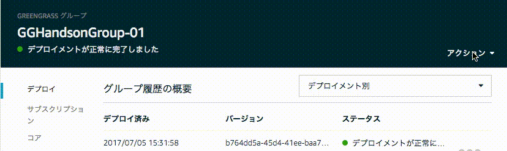

=======================================
Greengrassコアへのデプロイと動作確認
=======================================

アプリケーションを実際に動かして、動作を確認します。
本ハンズオンでは、センサーデバイスはRaspberry Pi上のCPU使用率を定期的にGreengrassコアのsensing/dataにuploadし、
これをトリガーに実行されたlambda関数が、Greengrassmコア上でCPU使用率を確認、閾値を超える、もしくは下回るとアラートデバイスのalertのon/offを切り替えます。

本ハンズオンでは、センサーデバイスのCPU使用率を制御するため、
センサーデバイスは、高負荷の処理を実行するswitchをシャドウとして保持します。
このswitchをonにすることで、センサーデバイスを閾値を超える高負荷状態にすることができます。
また、動作確認を容易化するため、センシングしたデータはエッジだけでなくクラウドにも送信します。

|

Greengrassの設定をデプロイする
====================================

AWS コンソールのGreengrassに戻ります。

Greengrassの設定画面に戻り、Greengrassグループ：GGHandsonGroup-<参加者番号> をクリックして下さい。

.. image:: images/10/greengrass-group.png

|

Greengrassグループの設定画面が出てきます。右上の [アクション] メニューから [デプロイ] を撰んで下さい。

|

初回のでデプロイ時、「デバイスによるコア検出方法の設定」画面が表示されます。[自動検出] をクリックします。

|

デプロイが完了すると、「 デプロイメントが正常に完了しました」と表示されます。

|

下記は、デプロイのGIFアニメーションです。画像をクリックするとアニメーションがスタートします。このケースでは、デプロイにおよそ30秒程度かかっています。

|

デプロイに失敗する場合があります。その場合は、再度、デプロイを行って下さい。

1分以上経ってもデプロイが完了しない場合、config.json 内の設定に誤りがある可能性があります。特に、"thingArn","iotHost","ggHost"を確認して下さい。コンソールを開き、~/greengrass/var/log/system/ 下のログを確認して下さい。

~/greengrass/var/log/ 下のファイルは、ユーザー "pi"ではアクセス出来ませんので、root権限でアクセスします。

::

  sudo su -
  cd /home/pi/greengrass/var/log/system

|

特に、下記のログファイルを確認してみて下さい。

::

  connection_manager.log
  ip_detector.log
  localwatch
  runtime.log
  syncmanager.log

|

これで、デプロイは、完了しました。

動作確認
=================

アラートデバイスを起動する
-----------------------------

コンソールを開き、下記を入力して、アラートデバイスを起動します。
-gを指定することで、Greengrass CoreのendpointをAWS IoTに確認し、Greengrass Coreに接続します。

::

  cd GGHandson/alert_device
  python ./ThingShadowAlarm.py -e xxxxxxxxxxxx.iot.us-west-2.amazonaws.com -r root-ca.pem -c yyyyyyyyyy-certificate.pem.crt -k yyyyyyyyyy-private.pem.key -n Alert-<参加者番号> -id Alert-<参加者番号> -g

|

各実行パラメータの説明は以下になります。

===================== ============================== ==============================
オプション                        説明                      値
===================== ============================== ==============================
-e, --endpoint        AWS IoTのEndpoint               xxxxxxxxxxxx.iot.us-west-2.amazonaws.com
-r, --rootCA          AWS IoTのサーバ証明書                 root-ca.pem
-c, --cert            アラートデバイスの証明書                   yyyyyyyyyy-certificate.pem.crt
-k, --key             アラートデバイスの秘密鍵                   yyyyyyyyyy-private.pem.key
-n, --thingName       アラートデバイス名                      Alert-<参加者番号>
-id, --clientId       アラートデバイスのクライアントID              Alert-<参加者番号>
-g, --greengrass       Greengrassモードで動作
===================== ============================== ==============================

アラートデバイスは、デバイスシャドウ のキー Alert の更新を待ち続けます。

エラーが出る場合、オプションに指定したパラメータが正しいか、モノに証明書がアタッチされているか、証明書にポリシーがアタッチされているか、ポリシーの内容は適切か、再度確認して下さい。

センサーデバイスを起動する
-----------------------------

新規にコンソールを開き、下記を入力して、アラートデバイスを起動します。
アラートデバイス同様、-gをオプションに指定します。

::

  cd GGHandson/sensor_device
  python ./ThingShadowSensor.py -e xxxxxxxxxxxx.iot.us-west-2.amazonaws.com -r root-ca.pem -c zzzzzzzzzz-certificate.pem.crt -k zzzzzzzzzz-private.pem.key -n Sensor-<参加者番号> -id Sensor-<参加者番号> -g

|

各実行パラメータの説明は以下になります。

===================== ============================== ==============================
オプション                        説明                      値
===================== ============================== ==============================
-e, --endpoint        AWS IoTのEndpoint               xxxxxxxxxxxx.iot.us-west-2.amazonaws.com
-r, --rootCA          AWS IoTのサーバ証明書                 root-ca.pem
-c, --cert            センサーデバイスの証明書                   zzzzzzzzzz-certificate.pem.crt
-k, --key             センサーデバイスの秘密鍵                   zzzzzzzzzz-private.pem.key
-n, --thingName       センサーデバイス名                      Sensor-<参加者番号>
-id, --clientId       センサーデバイスのクライアントID              Sensor-<参加者番号>
-g, --greengrass       Greengrassモードで動作
===================== ============================== ==============================

センサーデバイスは、Raspberry PiのCPUロードをトピック sensing/data にPublishし続けます。

エラーが出る場合、オプションに指定したパラメータが正しいか、モノに証明書がアタッチされているか、証明書にポリシーがアタッチされているか、ポリシーの内容は適切か、再度確認して下さい。

この時点で、Greengrassコアとアラートデバイス、センサーデバイス の3つのソフトウェアが同時に起動していることになります。

動作確認
===========================

AWS コンソールのAWS IoT に移動します。

メニューから [登録] をクリックし、センサーデバイスをクリックします。

|

メニューから、[シャドウ] をクリックし、センサーデバイスのシャドウを表示します。

.. image:: images/10/sensor-shadow.png

|

センサーデバイスのシャドウは、クラウドと同期する設定にしていましたので、この様に表示されます。

シャドウステータスに何も表示されない場合、サブスクリプションの設定かセンサーデバイスのクラウドに同期の設定に誤りが有る可能性があります。確認してみて下さい。

また、/home/pi/greengrass/var/log/system/router.log も確認してみて下さい。

"LoadSwitch": "off" の状態では、CPUロードは、数% 程度です。CPUロードを上げてみましょう。

右上の [編集] をクリックして、"desired"の"LoadSwitch"を"on"にして下さい。

::

  {
    "desired": {
      "LoadSwitch": "on"
    }
  }

|

その後、右上の [保存] をクリックして下さい。クラウド上の "LoadSwitch" センサーデバイスのシャドウと同期し、"reported"の"LoadSwitch"が"on" になります。

.. image:: images/10/shadow-sync.gif

|

Raspberry Piのリモート画面を見て下さい。

センサーデバイスが、"LoadSwitch" の状態が "on" になったことを認識し、内部でCPU負荷のかかる計算を実行します。その結果、Raspberry PiのCPU usageが 70% 程度に上がります。Greengrassのsensing/data トピックにデータがinputされると、Greengrassコア上でLambdaが実行されており、Lambda関数内の処理でCPU負荷が閾値を上回るとアラートデバイスのシャドウ "Alert"を "on"に更新します。アラートデバイスが、"Alert": "on" を確認すると、アラートデバイス アプリが、“!!!!!alert!!!!!" と表示します。

AWS IoTのコンソールで、"desired"内の”LoadSwitch"を "off"にすると、"!!!!!alert!!!!!" は停止します。

.. image:: images/10/shadow-load-switch-off.gif

|
