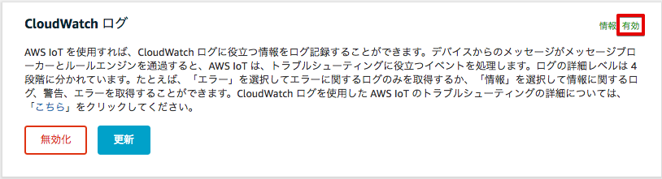
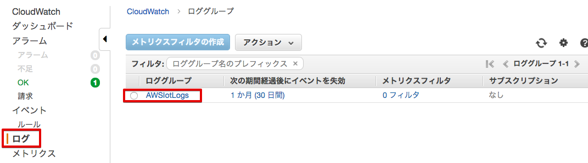
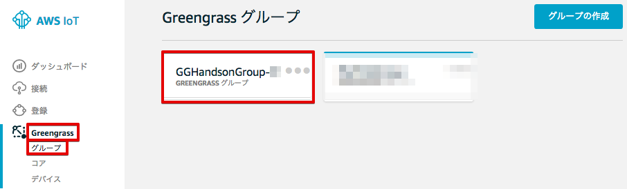

===============================
その他の設定（オプション）
===============================

CloudWatch Logsの設定
============================

AWS IoTのログはCloudWatch Logsで取得可能です。トラブルシューティングなどに使用する事ができます。

マネージメントコンソールのAWS IoTを開き、[設定]を選択し、[更新]をクリックします。

|

次に[新しいロールの作成]をクリックしてください。

|

次に"IAM role name"欄に、"AWSIoTCloudWatch"と入力し、[新しいロールの作成]をクリックします。

|

再度"IAM role name"欄から、"AWSIoTCloudWatch"を選択し、[ロールの更新]をクリックします。
"ロールは正常に更新されました"と表示されるので、"ログレベル"で"情報"を選択し、[完了]をクリックします。

|

CloudWatchログが有効になりました。

|

ログを確認するには、マネージメントコンソールのサービスメニューから[CloudWatch]をクリックして開き、左側のメニューの[ログ]を選択します。ロググループ一覧に”AWSIotLogs”が表示されていることを確認し、クリックします。

|

ログストリーム一覧にエントリが存在することを確認します。ログストリームの名前をクリックすることで、ログを閲覧することができます。

.. image:: images/12/CloudWatch-Log-2.png

|

GreengrassのCloudWatch Logsの設定
=========================================

Greengrassの設定画面に移動し、Greengrassグループ：GGHandsonGroup-<参加者番号> をクリックして下さい。

|

[ローカルログ設定]の編集をクリックします。

|

[別のログタイプの追加] をクリックします。

|

[ユーザー Lambda(推薦)] と、[Greengrass システム] をチェックし、[更新] をクリックします。

|

最後に、[保存] をクリックします。

|
